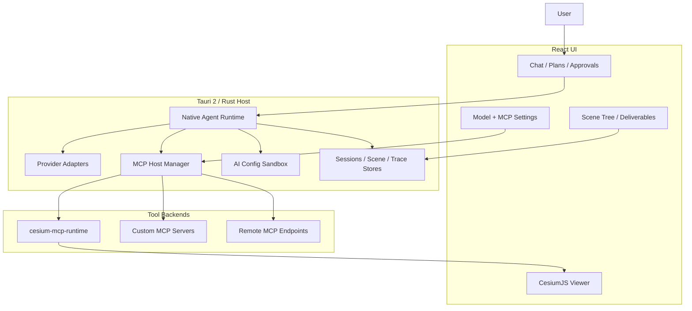

<div align="center">
  
  <h1>GaiaAgent</h1>
  <p><strong>AI-native GIS workspace for operating a 3D globe, MCP tools, and geospatial task workflows through conversation.</strong></p>

  <a href="https://github.com/gaopengbin/GaiaAgent/releases/tag/v0.3.7"></a>
  <a href="https://github.com/gaopengbin/GaiaAgent/blob/main/LICENSE"></a>
  <a href="https://github.com/gaopengbin/GaiaAgent/actions/workflows/ci.yml"></a>
  <a href="https://github.com/gaopengbin/cesium-mcp"></a>
  <a href="https://tauri.app/"></a>

  <br/><br/>
  <a href="README.zh-CN.md">简体中文</a> | English
  <br/><br/>
  
</div>

## What is GaiaAgent?

GaiaAgent is a desktop AI GIS application built with Tauri, React, Rust, CesiumJS, and MCP. It lets an assistant reason about a geospatial task, call GIS tools, operate a live 3D map, remember scene state, and package task deliverables.

The product direction is not just “chat with a map”. GaiaAgent is becoming a controllable GeoAgent workbench:

- a conversation panel for planning, tool execution, approvals, and multimodal context;
- a Cesium-powered 3D scene that can be restored per conversation;
- an MCP host that can run local and remote tools;
- a GIS-style scene/layer tree for reviewing and managing map objects;
- a guarded AI configuration sandbox so the agent can propose capability fixes without silently mutating the app.

## Download

Latest release: [GaiaAgent v0.3.7](https://github.com/gaopengbin/GaiaAgent/releases/tag/v0.3.7)

Published artifacts include:

- Windows x64: `.exe` installer and `.msi`
- macOS Apple Silicon: `.dmg`
- Linux x64: `.deb`, `.rpm`

## Highlights in v0.3.7

- **Reliable Windows upgrades**: GaiaAgent closes all managed MCP child processes during shutdown, and the NSIS installer removes only stale bundled runtime processes before replacing files.
- **Convergent web tasks**: equivalent searches and page fetches are deduplicated within a run, the agent must answer from collected evidence before exhausting its round budget, and overlapping external fetch tools are hidden when the built-in fetcher is available.

## Highlights in v0.3.6

- **Keyless built-in web search**: `open-websearch 2.1.11` ships with GaiaAgent and exposes only guarded `web_search` and `web_fetch` tools to the agent, with Bing, Baidu, and DuckDuckGo support and no separate API key.
- **Self-contained MCP runtime**: external stdio MCP servers prefer GaiaAgent's bundled Node.js and npm runtime on clean Windows installations instead of depending on the user's local development environment.
- **Safer tool routing**: built-in web content is marked as untrusted external data, duplicate MCP tool names resolve deterministically, and network access follows the selected approval mode.

## Highlights in v0.3.5

- **Reliable conversation-scene binding**: switching or refreshing a conversation restores its basemap, camera, CZML/KML/GeoJSON layers, and replayable scene content in a deterministic order.
- **Session-persistent image assets**: pasted images receive stable local attachment handles, remain usable across later turns and app restarts, and can be referenced directly by Billboard and nested CZML image fields without public hosting.
- **Cleaner GIS scene tree**: implementation-only helper assets are folded away, icons distinguish points, routes, areas, imagery, terrain, models, and animations, and playable layers expose play, pause, reset, and speed controls.
- **More reliable agent lifecycle**: failed or cancelled runs settle pending tool cards, token-budget failures stop cleanly, and simple tasks are no longer forced into unnecessary visible plans.
- **Desktop/runtime fixes**: bundled GIS tools, CC Switch/provider routing, Tianditu credentials, basemap persistence, and Windows production startup behavior are more robust.

## Highlights in v0.3.0

- **Native agent runtime**: Rust-side model loop, provider adapters, tool execution, cancellation, timeouts, budgets, approval modes, and trace events.
- **CC Switch / Claude-friendly provider routing**: OpenAI-compatible, Anthropic/Claude, Ollama, CC Switch gateways, and local/remote base URL health checks.
- **MCP host improvements**: local stdio servers, remote streamable HTTP, OAuth foundation, elicitation handling, server status, and safer launcher validation.
- **AI configuration sandbox**: the agent can prepare MCP configuration patches; users review and apply them before real config writes happen.
- **Conversation context controls**: status panel, manual compaction, automatic tool-result compaction, token warnings, and safer context clearing that does not wipe the scene.
- **Scene persistence**: conversations and map scenes are bound together; refresh/session switch can restore camera and map objects.
- **GIS-style scene tree**: layers are primary nodes, helper entities are folded under layers, with locate / visibility / rename / lock / delete actions.
- **Multimodal chat**: pasted/uploaded images are sent as model attachments, rendered in user messages, and image tool outputs are shown as previews instead of raw base64.
- **Markdown and tool UI polish**: rendered GFM tables/lists/code, loading/streaming states, expandable thoughts, tool cards, and clickable suggested next steps.
- **Deliverables workflow**: scene JSON, Markdown report, GeoJSON/CSV assets, analysis results, and ZIP package import/export foundations.

## Features

### AI + GIS interaction

- Natural-language map operations: fly to locations, add markers, load layers, analyze spatial data, measure, filter, buffer, and export results.
- Tool-aware task planning with live plan cards, approval controls, retry / skip / replan, and traceable tool bindings.
- Three execution modes inspired by Codex-style autonomy:
  - safe: read-only operations are automatic, risky work requires confirmation;
  - balanced: map operations can run, higher-risk operations require confirmation;
  - auto: the agent proceeds as automatically as policy allows.

### Scene and data workbench

- Per-session scene state with camera, layers, entities, assets, active object, and recent object refs.
- GIS-style scene panel for layer/entity management.
- Import/export:
  - GaiaAgent scene JSON
  - GeoJSON / CSV
  - Markdown report
  - deliverables ZIP package
- Basic analysis asset registry and business-example workflow entry.

### MCP and extensibility

- Built-in Cesium MCP runtime support with GIS toolsets such as camera, entity, layer, tiles, heatmap, trajectory, interaction, scene, and geolocation.
- Add custom MCP servers from the app UI or through the AI configuration sandbox.
- Local command validation and bounded environment handling reduce accidental or malicious launcher misuse.
- Remote MCP support is scoped to safer endpoints; OAuth and elicitation flows are part of the host foundation.

### Model and context management

- Supports OpenAI-compatible providers, Anthropic/Claude-style providers, Ollama, and CC Switch local proxy workflows.
- Context status panel shows turn count, estimated bytes, and compaction summary.
- Manual “compact context” keeps recent turns and summarizes older history.
- Large image/tool outputs are compacted for provider context while remaining visible in the UI.

## Architecture



## Quick start for development

Requirements:

- Node.js version from `.node-version`
- Rust toolchain
- Platform dependencies required by Tauri

```bash
git clone https://github.com/gaopengbin/GaiaAgent.git
cd GaiaAgent
npm ci
npm run tauri:dev
```

Useful commands:

```bash
npm run check:web
npm run build
cargo test --manifest-path src-tauri/Cargo.toml --locked
cargo clippy --manifest-path src-tauri/Cargo.toml --locked --all-targets -- -D warnings
npm run sbom
```

## MCP example

Add an MCP server in the app settings or let the AI prepare a reviewed MCP configuration patch.

```json
{
  "amap-maps": {
    "command": "npx",
    "args": ["-y", "@amap/amap-maps-mcp-server"],
    "env": { "AMAP_MAPS_API_KEY": "your-key" },
    "enabled": true
  }
}
```

GaiaAgent validates MCP launch configuration before starting local servers. For published releases, bundled/runtime-managed tools are preferred over depending on a user's global shell environment.

## Release

Releases are built by GitHub Actions from version tags:

```bash
git tag -a vX.Y.Z -m "Release vX.Y.Z"
git push origin vX.Y.Z
```

The release workflow builds Windows x64, macOS arm64, and Linux x64 packages and uploads SBOM artifacts. Tagged releases require `TAURI_SIGNING_PRIVATE_KEY` in repository Actions secrets.

## Project structure

```text
GaiaAgent/
├── src/                         # React + TypeScript frontend
│   ├── agent/                   # Timeline state, scene state, sandbox types
│   ├── components/              # ChatPanel, ScenePanel, SettingsDialog, CesiumViewer
│   ├── components/ai-elements/  # Chat/message/tool UI primitives
│   └── hooks/                   # useTauriAgent and app-side orchestration
├── src-tauri/                   # Rust backend and Tauri app
│   └── src/                     # agent runtime, MCP host, sandbox, telemetry, IPC
├── docs/                        # Architecture, security, testing, release docs
├── public/                      # Static web assets and generated Cesium bridge
└── package.json
```

## License

[MIT](LICENSE)
