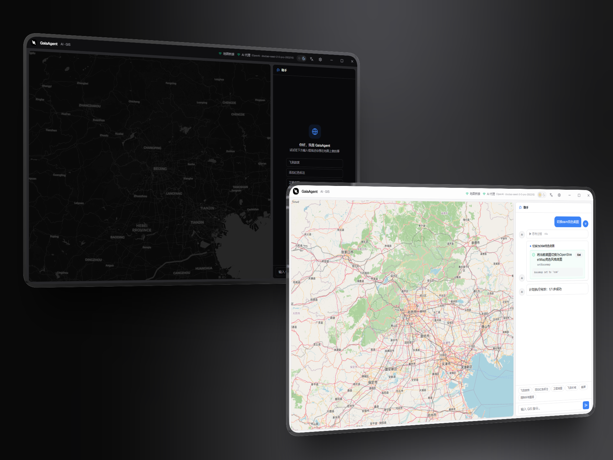
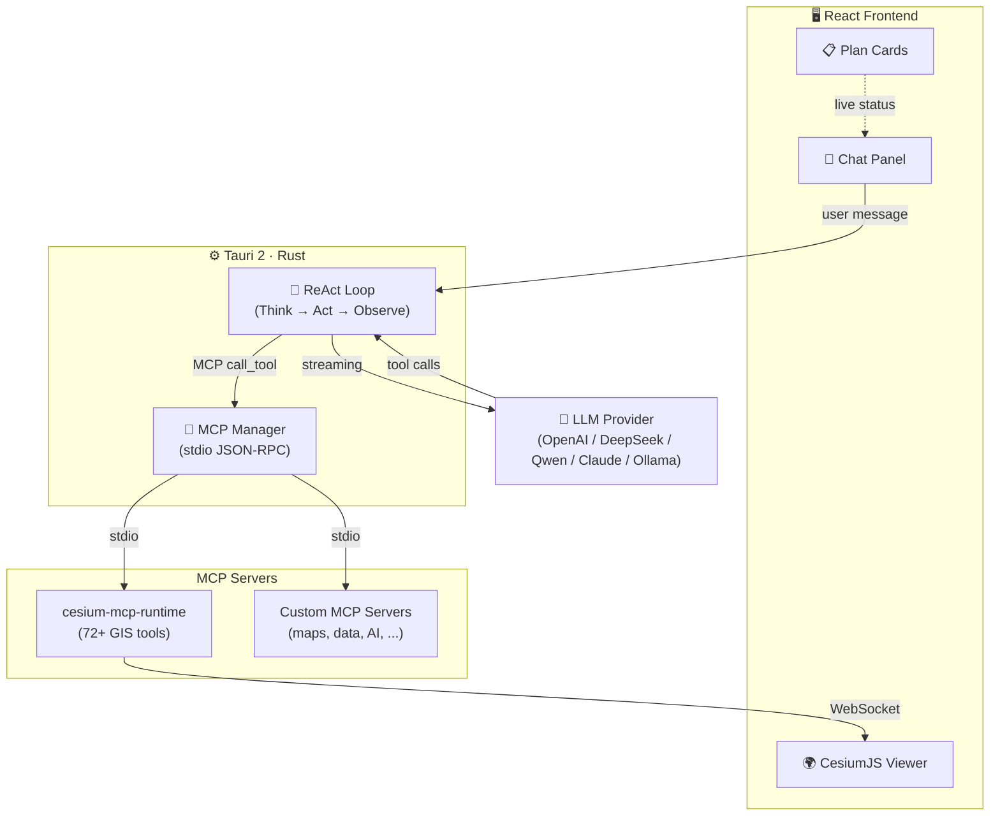

<div align="center">
  
  <h1>GaiaAgent</h1>
  <p><strong>🌍 AI-Powered 3D GIS Assistant — Talk to 3D Globe in natural language</strong></p>

  <a href="https://github.com/gaopengbin/GaiaAgent/blob/main/LICENSE"></a>
  <a href="https://github.com/gaopengbin/GaiaAgent/stargazers"></a>
  <a href="https://github.com/gaopengbin/cesium-mcp"></a>
  <a href="https://tauri.app/"></a>

  <br/><br/>
  <a href="README.zh-CN.md">简体中文</a> | English
  <br/><br/>
  
</div>

<br/>

GaiaAgent is a desktop / web AI assistant that lets you control a live [CesiumJS](https://cesium.com/) 3D globe through conversation. It connects LLM reasoning with real-time geospatial visualization via the [cesium-mcp](https://github.com/gaopengbin/cesium-mcp) protocol.

## ✨ Features

- 🗣️ **Natural Language Control** — Ask questions, the AI executes GIS operations on the 3D globe
- 🧠 **Multi-LLM Support** — Ollama, OpenAI, DeepSeek, Qwen, Claude, and any OpenAI-compatible API
- 🗺️ **72+ GIS Tools** — Camera, entities, layers, heatmaps, trajectories, 3D Tiles, terrain, and more
- 🖥️ **Desktop App** — Tauri 2 native app (~8 MB), cross-platform
- 🔄 **ReAct Agent Loop** — Think → Act → Observe multi-round reasoning with automatic error recovery
- 🔌 **MCP Protocol** — Full stdio MCP support, add custom MCP servers (maps, data, AI, etc.)
- 📊 **Token Tracking** — Per-round token consumption displayed in chat
- 📋 **Visual Plan Cards** — AI decomposes tasks into step-by-step plans with live execution status

## 🏗️ Architecture



## � Quick Start

```bash
git clone https://github.com/gaopengbin/GaiaAgent.git
cd GaiaAgent
npm install
npm run tauri:dev
```

Configure LLM provider and MCP servers in the in-app settings dialog (⚙️).

## 🤖 LLM Providers

Set `LLM_PROVIDER` in `.env`:

| Provider | Value | Notes |
|----------|-------|-------|
| Ollama | `ollama` | Local, no API key needed |
| OpenAI | `openai` | `OPENAI_API_KEY` required |
| OpenAI-compatible | `openai_compat` | LM Studio / vLLM / LocalAI |
| DashScope (Qwen) | `dashscope` | Alibaba Cloud |
| DeepSeek | `deepseek` | DeepSeek API |
| Anthropic | `anthropic` | Claude |

## 🛠️ Available Tools

72+ tools across 12 toolsets via [cesium-mcp](https://github.com/gaopengbin/cesium-mcp), plus any custom MCP servers you add:

| Toolset | Description |
|---------|------------|
| `view` | Viewport & scene management |
| `camera` | Camera fly-to, zoom, rotation |
| `entity` | Points, lines, polygons, labels |
| `entity-ext` | Advanced entity operations |
| `layer` | Imagery & terrain layers |
| `tiles` | 3D Tiles loading & styling |
| `heatmap` | Heatmap visualization |
| `trajectory` | Animated trajectory playback |
| `animation` | Timeline & clock control |
| `interaction` | Click, pick, measure |
| `scene` | Scene-level settings |
| `geolocation` | Geocoding & search |

> Configure tool sets and add custom MCP servers in the settings dialog.

## 🔌 MCP Support

GaiaAgent's Tauri edition supports the [Model Context Protocol](https://modelcontextprotocol.io/) for extensible tool integration. Add any MCP server via the built-in settings dialog:

```json
{
  "amap-maps": {
    "command": "npx",
    "args": ["-y", "@amap/amap-maps-mcp-server"],
    "env": { "AMAP_MAPS_API_KEY": "your-key" },
    "enabled": true
  }
}
```

MCP servers are managed through stdio JSON-RPC, with auto-start on launch and live status indicators.

## 🔄 CI / Release

Automated multi-platform builds via GitHub Actions. Push a version tag to create a release:

```bash
git tag v0.1.0
git push origin v0.1.0
```

Builds for: Windows x64, macOS arm64/x64, Linux x64.

## 📁 Project Structure

```
GaiaAgent/
├── src/                        # React + TypeScript frontend
│   ├── agent/                  # ReAct loop, LLM, planner, prompts
│   ├── components/             # CesiumViewer, ChatPanel, PlanCard, ...
│   ├── hooks/                  # useTauriAgent, useBridgeWS
│   └── i18n/                   # Internationalization (en/zh)
├── src-tauri/                  # Rust backend (Tauri 2)
│   └── src/                    # lib.rs (IPC), mcp.rs (MCP manager)
├── public/                     # Static assets (Cesium, bridge)
├── docs/                       # Design docs & resources
└── package.json
```

## 📄 License

[MIT](LICENSE)
