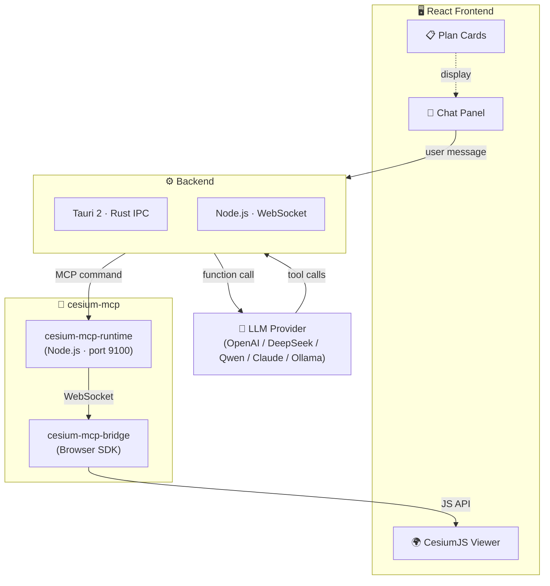

<div align="center">
  
  <h1>GaiaAgent</h1>
  <p><strong>🌍 AI-Powered 3D GIS Assistant — Talk to 3D Globe in natural language</strong></p>

  <a href="https://github.com/gaopengbin/GaiaAgent/blob/main/LICENSE"></a>
  <a href="https://github.com/gaopengbin/GaiaAgent/stargazers"></a>
  <a href="https://github.com/gaopengbin/cesium-mcp"></a>
  <a href="https://tauri.app/"></a>

  <br/><br/>
  <a href="README.zh-CN.md">简体中文</a> | English
  <br/><br/>
  
</div>

<br/>

GaiaAgent is a desktop / web AI assistant that lets you control a live [CesiumJS](https://cesium.com/) 3D globe through conversation. It connects LLM reasoning with real-time geospatial visualization via the [cesium-mcp](https://github.com/gaopengbin/cesium-mcp) protocol.

## ✨ Features

- 🗣️ **Natural Language Control** — Ask questions, the AI executes GIS operations on the 3D globe
- 🧠 **Multi-LLM Support** — Ollama, OpenAI, DeepSeek, Qwen, Claude, and any OpenAI-compatible API
- 🗺️ **59 GIS Tools** — Camera, entities, layers, heatmaps, trajectories, 3D Tiles, and more
- 🖥️ **Two Editions** — Tauri desktop app (~15 MB) or browser-based Web UI
- 📋 **Plan & Execute** — AI decomposes complex tasks into step-by-step plans with visual cards

## 🏗️ Architecture



## 📦 Two Editions

| | 🖥️ Tauri Desktop | 🌐 Web UI |
|---|---|---|
| Path | [`examples/tauri-app/`](examples/tauri-app/) | [`examples/web_ui/`](examples/web_ui/) |
| Backend | Rust (Tauri IPC) | Node.js (Express + WebSocket) |
| Packaging | ~15 MB binary | Browser-based |
| LLM Call | Rust HTTP → OpenAI-compat API | Node.js `openai` / `@anthropic-ai/sdk` |
| MCP | HTTP `/api/command` | stdio MCP protocol |

## 🚀 Quick Start

### Tauri Desktop

```bash
cd examples/tauri-app
cp .env.example .env   # configure LLM provider
npm install
npm run tauri:dev
```

### Web UI

```bash
# Backend
cd examples/web_ui/backend
cp .env.example .env   # configure LLM provider
npm install
npm run dev

# Frontend (separate terminal)
cd examples/web_ui/frontend
npm install
npm run dev
```

## 🤖 LLM Providers

Set `LLM_PROVIDER` in `.env`:

| Provider | Value | Notes |
|----------|-------|-------|
| Ollama | `ollama` | Local, no API key needed |
| OpenAI | `openai` | `OPENAI_API_KEY` required |
| OpenAI-compatible | `openai_compat` | LM Studio / vLLM / LocalAI |
| DashScope (Qwen) | `dashscope` | Alibaba Cloud |
| DeepSeek | `deepseek` | DeepSeek API |
| Anthropic | `anthropic` | Claude |

## 🛠️ Available Tools

59 tools across 12 toolsets via [cesium-mcp](https://github.com/gaopengbin/cesium-mcp):

| Toolset | Description |
|---------|------------|
| `view` | Viewport & scene management |
| `camera` | Camera fly-to, zoom, rotation |
| `entity` | Points, lines, polygons, labels |
| `entity-ext` | Advanced entity operations |
| `layer` | Imagery & terrain layers |
| `tiles` | 3D Tiles loading & styling |
| `heatmap` | Heatmap visualization |
| `trajectory` | Animated trajectory playback |
| `animation` | Timeline & clock control |
| `interaction` | Click, pick, measure |
| `scene` | Scene-level settings |
| `geolocation` | Geocoding & search |

> Set `CESIUM_TOOLSETS=all` in `.env` to enable everything.

## 📁 Project Structure

```
GaiaAgent/
├── examples/
│   ├── tauri-app/              # Tauri 2 + React desktop app
│   │   ├── src/                # React frontend (CesiumViewer + ChatPanel)
│   │   └── src-tauri/          # Rust backend (LLM + MCP integration)
│   └── web_ui/
│       ├── backend/            # Node.js + Express + WebSocket server
│       ├── frontend/           # React frontend (shared components)
│       └── static/             # Pre-built frontend assets
├── docs/                       # Design docs & resources
└── README.md
```

## 📄 License

[MIT](LICENSE)
