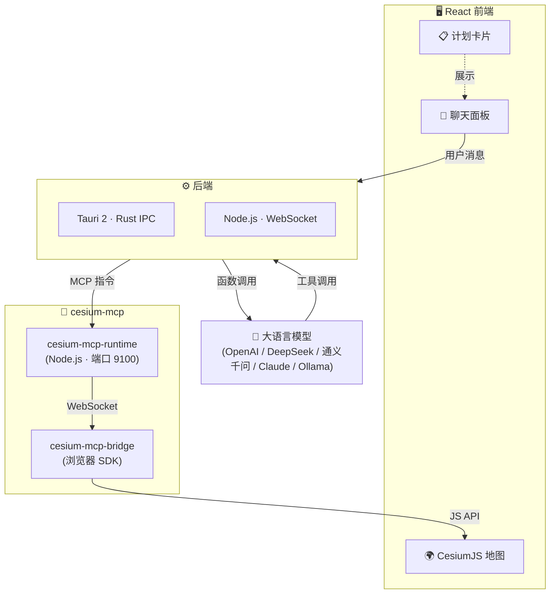

<div align="center">
  
  <h1>GaiaAgent（盖亚）</h1>
  <p><strong>🌍 AI 驱动的三维 GIS 助手 — 用自然语言对话操控三维地球</strong></p>

  <a href="https://github.com/gaopengbin/GaiaAgent/blob/main/LICENSE"></a>
  <a href="https://github.com/gaopengbin/GaiaAgent/stargazers"></a>
  <a href="https://github.com/gaopengbin/cesium-mcp"></a>
  <a href="https://tauri.app/"></a>

  <br/><br/>
  简体中文 | <a href="README.md">English</a>
  <br/><br/>
  
</div>

<br/>

GaiaAgent 是一款桌面/网页端 AI 助手，通过自然语言对话操控 [CesiumJS](https://cesium.com/) 三维地球。它基于 [cesium-mcp](https://github.com/gaopengbin/cesium-mcp) 协议，将大语言模型的推理能力与实时地理空间可视化相连接。

## ✨ 特性

- 🗣️ **自然语言操控** — 对话即指令，AI 在三维地球上执行 GIS 操作
- 🧠 **多模型支持** — Ollama、OpenAI、DeepSeek、通义千问、Claude 及任意 OpenAI 兼容 API
- 🗺️ **59 个 GIS 工具** — 相机、实体、图层、热力图、轨迹、3D Tiles 等
- 🖥️ **双版本** — Tauri 桌面应用（约 15 MB）或浏览器端 Web UI
- 📋 **规划与执行** — AI 将复杂任务拆解为分步计划，以可视化卡片展示

## 🏗️ 架构



## 📦 双版本

| | 🖥️ Tauri 桌面版 | 🌐 Web UI |
|---|---|---|
| 路径 | [`examples/tauri-app/`](examples/tauri-app/) | [`examples/web_ui/`](examples/web_ui/) |
| 后端 | Rust (Tauri IPC) | Node.js (Express + WebSocket) |
| 打包 | ~15 MB 二进制 | 浏览器直接访问 |
| LLM 调用 | Rust HTTP → OpenAI 兼容 API | Node.js `openai` / `@anthropic-ai/sdk` |
| MCP | HTTP `/api/command` | stdio MCP 协议 |

## 🚀 快速开始

### Tauri 桌面版

```bash
cd examples/tauri-app
cp .env.example .env   # 配置 LLM 提供商
npm install
npm run tauri:dev
```

### Web UI

```bash
# 后端
cd examples/web_ui/backend
cp .env.example .env   # 配置 LLM 提供商
npm install
npm run dev

# 前端（另开终端）
cd examples/web_ui/frontend
npm install
npm run dev
```

## 🤖 支持的 LLM

在 `.env` 中设置 `LLM_PROVIDER`：

| 提供商 | 值 | 说明 |
|----------|-------|-------|
| Ollama | `ollama` | 本地部署，无需 API 密钥 |
| OpenAI | `openai` | 需要 `OPENAI_API_KEY` |
| OpenAI 兼容 | `openai_compat` | LM Studio / vLLM / LocalAI |
| 通义千问 | `dashscope` | 阿里云 DashScope |
| DeepSeek | `deepseek` | DeepSeek API |
| Anthropic | `anthropic` | Claude |

## 🛠️ 可用工具

通过 [cesium-mcp](https://github.com/gaopengbin/cesium-mcp) 提供 12 个工具集共 59 个工具：

| 工具集 | 说明 |
|---------|------|
| `view` | 视口与场景管理 |
| `camera` | 相机飞行、缩放、旋转 |
| `entity` | 点、线、面、标注 |
| `entity-ext` | 高级实体操作 |
| `layer` | 影像与地形图层 |
| `tiles` | 3D Tiles 加载与样式 |
| `heatmap` | 热力图可视化 |
| `trajectory` | 动态轨迹回放 |
| `animation` | 时间轴与时钟控制 |
| `interaction` | 点击、拾取、量测 |
| `scene` | 场景级设置 |
| `geolocation` | 地理编码与搜索 |

> 在 `.env` 中设置 `CESIUM_TOOLSETS=all` 启用全部工具。

## 📁 项目结构

```
GaiaAgent/
├── examples/
│   ├── tauri-app/              # Tauri 2 + React 桌面应用
│   │   ├── src/                # React 前端（CesiumViewer + 聊天面板）
│   │   └── src-tauri/          # Rust 后端（LLM + MCP 集成）
│   └── web_ui/
│       ├── backend/            # Node.js + Express + WebSocket 服务
│       ├── frontend/           # React 前端（共享组件）
│       └── static/             # 预构建的前端资源
├── docs/                       # 设计文档与资源
└── README.md
```

## 📄 许可证

[MIT](LICENSE)
