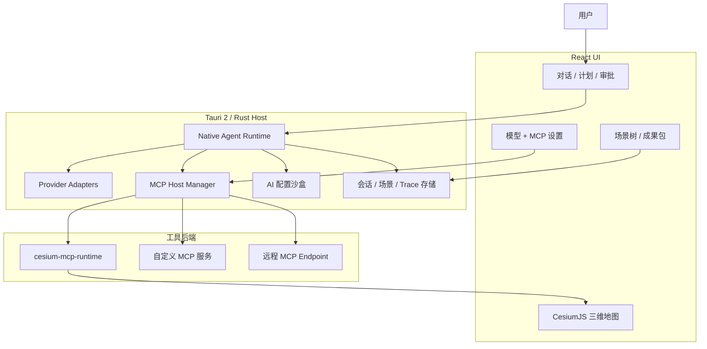

<div align="center">
  
  <h1>GaiaAgent（盖亚）</h1>
  <p><strong>面向三维地球、MCP 工具和地理空间任务流的 AI 原生 GIS 工作台。</strong></p>

  <a href="https://github.com/gaopengbin/GaiaAgent/releases/tag/v0.3.0"></a>
  <a href="https://github.com/gaopengbin/GaiaAgent/blob/main/LICENSE"></a>
  <a href="https://github.com/gaopengbin/GaiaAgent/actions/workflows/ci.yml"></a>
  <a href="https://github.com/gaopengbin/cesium-mcp"></a>
  <a href="https://tauri.app/"></a>

  <br/><br/>
  简体中文 | <a href="README.md">English</a>
  <br/><br/>
  
</div>

## GaiaAgent 是什么？

GaiaAgent 是一款基于 Tauri、React、Rust、CesiumJS 和 MCP 的桌面端 AI GIS 应用。它让 AI 助手可以围绕地理空间任务进行推理、调用 GIS 工具、操控实时三维地图、恢复会话场景，并打包交付成果。

它的目标不只是“和地图聊天”，而是一个可控的 GeoAgent 工作台：

- 对话面板负责规划、工具执行、审批、多模态上下文和结果解释；
- Cesium 三维场景和会话绑定，刷新或切换会话后可以恢复场景；
- MCP Host 可以管理本地和远程工具；
- GIS 软件常见的图层/场景树用于审查和管理地图对象；
- AI 配置沙盒允许助手提出能力修复方案，但真实写入前必须经过用户确认。

## 下载

最新版本：[GaiaAgent v0.3.0](https://github.com/gaopengbin/GaiaAgent/releases/tag/v0.3.0)

已发布产物包括：

- Windows x64：`.exe` 安装器和 `.msi`
- macOS Apple Silicon：`.dmg`
- Linux x64：`.AppImage`、`.deb`、`.rpm`

## v0.3.0 主要更新

- **原生 Agent Runtime**：模型循环、provider adapter、工具执行、取消、超时、预算、审批模式和 trace 事件进入 Rust 后端。
- **CC Switch / Claude 友好接入**：支持 OpenAI 兼容、Anthropic/Claude、Ollama、CC Switch 网关和本地/远程 base URL 健康检查。
- **MCP Host 增强**：本地 stdio、远程 streamable HTTP、OAuth 基础、elicitation、服务状态和更安全的启动器校验。
- **AI 配置沙盒**：AI 可以生成 MCP 配置补丁，用户审查并点击应用后才写入真实配置。
- **上下文控制**：上下文状态面板、手动压缩、自动工具结果压缩、token 风险提示，以及不会误清地图场景的上下文清理。
- **场景持久化**：会话与地图场景绑定，刷新和切换会话可恢复相机和地图对象。
- **GIS 风格场景树**：图层作为主节点，辅助实体折叠到图层下，支持定位、显隐、重命名、锁定和删除。
- **多模态对话**：粘贴/上传图片会作为模型附件发送，用户消息和工具结果都能预览图片，不再只显示 base64。
- **Markdown 与工具 UI 优化**：GFM 表格/列表/代码渲染、等待/输出状态、思考折叠、工具卡片和可点击后续建议。
- **成果交付工作流**：场景 JSON、Markdown 报告、GeoJSON/CSV、分析结果和 ZIP 包导入导出基础。

## 功能概览

### AI + GIS 交互

- 自然语言地图操作：飞行定位、添加标注、加载图层、空间分析、测量、过滤、缓冲区、导出结果。
- 工具感知的任务计划：计划卡片、审批、重试、跳过、重新规划和可追踪的工具绑定。
- 类似 Codex 的三种执行模式：
  - safe：只读自动，其他需要确认；
  - balanced：地图操作可自动执行，高风险操作需要确认；
  - auto：在策略允许范围内尽量自动推进。

### 场景与数据工作台

- 按会话保存场景状态，包括相机、图层、实体、资产、当前对象和最近对象。
- GIS 风格场景面板，用于图层/实体管理。
- 导入导出：
  - GaiaAgent 场景 JSON
  - GeoJSON / CSV
  - Markdown 报告
  - 成果 ZIP 包
- 基础分析资产注册表和业务样例入口。

### MCP 与扩展能力

- 内置 Cesium MCP runtime 支持，覆盖 camera、entity、layer、tiles、heatmap、trajectory、interaction、scene、geolocation 等 GIS 工具集。
- 可从应用 UI 添加自定义 MCP，也可以让 AI 生成待审查的 MCP 配置补丁。
- 本地命令、参数和继承环境会被校验，降低误配置或恶意启动器风险。
- 远程 MCP 限定更安全的 endpoint；OAuth 和 elicitation 是 Host 基础能力的一部分。

### 模型与上下文管理

- 支持 OpenAI 兼容 provider、Anthropic/Claude 类 provider、Ollama 和 CC Switch 本地代理流程。
- 上下文面板展示轮次、估算大小和压缩摘要。
- 手动“压缩上下文”保留近期上下文并摘要旧历史。
- 大图片和大工具结果会压缩进入模型上下文，但 UI 仍保留可读预览。

## 架构



## 开发启动

要求：

- `.node-version` 指定的 Node.js 版本
- Rust toolchain
- Tauri 所需平台依赖

```bash
git clone https://github.com/gaopengbin/GaiaAgent.git
cd GaiaAgent
npm ci
npm run tauri:dev
```

常用命令：

```bash
npm run check:web
npm run build
cargo test --manifest-path src-tauri/Cargo.toml --locked
cargo clippy --manifest-path src-tauri/Cargo.toml --locked --all-targets -- -D warnings
npm run sbom
```

## MCP 示例

可以在应用设置里添加 MCP 服务，也可以让 AI 生成一个经过用户审查的 MCP 配置补丁。

```json
{
  "amap-maps": {
    "command": "npx",
    "args": ["-y", "@amap/amap-maps-mcp-server"],
    "env": { "AMAP_MAPS_API_KEY": "your-key" },
    "enabled": true
  }
}
```

GaiaAgent 会在启动本地 MCP 前校验配置。对于发布版本，优先使用应用内托管或锁定的运行时能力，而不是依赖用户全局 shell 环境。

## 发布

版本发布由 GitHub Actions 根据 tag 构建：

```bash
git tag -a v0.3.0 -m "Release v0.3.0"
git push origin v0.3.0
```

Release workflow 会构建 Windows x64、macOS arm64 和 Linux x64 安装包，并上传 SBOM artifacts。正式 tag 发布需要在仓库 Actions Secrets 中配置 `TAURI_SIGNING_PRIVATE_KEY`。

## 项目结构

```text
GaiaAgent/
├── src/                         # React + TypeScript 前端
│   ├── agent/                   # Timeline、场景状态、沙盒类型
│   ├── components/              # ChatPanel、ScenePanel、SettingsDialog、CesiumViewer
│   ├── components/ai-elements/  # 对话、消息、工具 UI 组件
│   └── hooks/                   # useTauriAgent 和应用侧编排
├── src-tauri/                   # Rust 后端与 Tauri 应用
│   └── src/                     # agent runtime、MCP host、sandbox、telemetry、IPC
├── docs/                        # 架构、安全、测试、发布文档
├── public/                      # 静态资源和生成的 Cesium bridge
└── package.json
```

## 许可证

[MIT](LICENSE)
