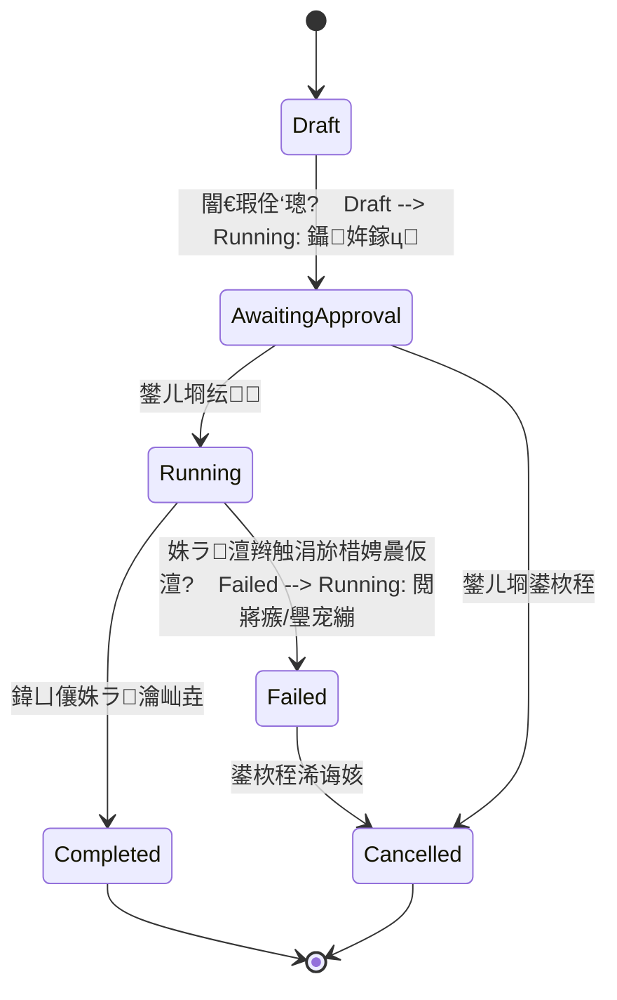

# GaiaAgent 鍦烘櫙浠诲姟宸ヤ綔鍙拌璁?
> 鐘舵€侊細Draft
> 鍒涘缓鏃ユ湡锛?026-07-03
> 鐩爣鐗堟湰锛歷0.6.x
> 鍏宠仈鏂囨。锛?>
> - `docs/design/business-capability-roadmap.md`
> - `docs/design/context-memory.md`
> - `docs/design/gaiaagent-modernization-roadmap.md`

## 1. 鑳屾櫙

褰撳墠 GaiaAgent 宸插叿澶囨ā鍨嬫帴鍏ャ€丮CP銆佸璇濆巻鍙层€佷笂涓嬫枃鍘嬬缉銆佸鎵规ā寮忋€乀race 鍜?AI Elements 瀵硅瘽 UI 绛夊熀纭€鑳藉姏锛屼絾涓氬姟灞備粛鍋忊€滃崟娆″伐鍏疯皟鐢ㄢ€濓細鐢ㄦ埛鍙互璁?AI 椋炲埌鏌愬湴銆佹坊鍔犳爣娉ㄣ€佸垏鎹㈠簳鍥撅紝鍗村緢闅炬寔缁鐞嗏€滃湴鍥句笂宸茬粡鏈変粈涔堚€濄€佸鐢ㄥ凡鍒涘缓瀵硅薄锛屾垨鑰呰 AI 瀹屾垚涓€涓畬鏁?GIS 浠诲姟闂幆銆?
涓嬩竴闃舵鐨勭洰鏍囨槸鎶?GaiaAgent 浠庘€滆兘鑱婂ぉ鎺у埗鍦扮悆鈥濆崌绾т负鈥滆兘绠＄悊鍦烘櫙銆佺紪鎺掍换鍔°€佹矇娣€鎴愭灉鐨?GIS AI 宸ヤ綔鍙扳€濄€?
## 2. 浜у搧鐩爣

鏈樁娈佃仛鐒︿笁涓牳蹇冭兘鍔涳細

1. 鍦烘櫙瀵硅薄妯″瀷锛氱郴缁熸槑纭煡閬撳湴鍥句笂鏈夊摢浜涘璞°€佸璞′粠鍝噷鏉ャ€佽兘琚€庢牱鎿嶄綔銆?2. 鍦板浘瀵硅薄绠＄悊闈㈡澘锛氱敤鎴峰彲浠ュ彲瑙嗗寲绠＄悊 AI 鎴栬嚜宸卞垱寤虹殑鏍囨敞銆佸浘灞傘€佽矾绾裤€佸尯鍩熷拰鏌ヨ缁撴灉銆?3. 浠诲姟缂栨帓鑳藉姏锛欰I 鑳芥妸澶嶆潅鑷劧璇█鐩爣鎷嗚В涓哄彲杩借釜銆佸彲纭銆佸彲鎭㈠鐨勫姝ラ GIS 浠诲姟銆?
瀹屾垚鍚庯紝鐢ㄦ埛搴旇鑳借嚜鐒跺湴璇达細

- 鈥滄妸鍒氭墠閭ｄ釜绾㈣壊鏍囨敞鏀瑰悕涓洪泦鍚堢偣銆傗€?- 鈥滈殣钘忓垰鎵嶇敓鎴愮殑璺嚎锛屽彧淇濈暀閫旂粡鐐广€傗€?- 鈥滃仛涓€涓晠瀹埌鍏揪宀暱鍩庣殑鏃呮父璺嚎灞曠ず锛屾爣鍑鸿捣鐐广€佺粓鐐瑰拰娌块€旇鏄庛€傗€?- 鈥滄竻绌?AI 鍒氭墠鍒涘缓鐨勬墍鏈夊璞°€傗€?
## 3. 璁捐鍘熷垯

- 瀵硅薄浼樺厛锛氭墍鏈夊湴鍥句骇鐗╅兘搴旇惤鍒扮粨鏋勫寲瀵硅薄锛岃€屼笉鏄彧鍦?Cesium 閲屼复鏃剁敾涓€涓嬨€?- 宸ュ叿缁撴灉鍙拷韪細AI 鍒涘缓銆佷慨鏀广€佸垹闄ゅ璞℃椂锛岃璁板綍鏉ユ簮宸ュ叿銆佷細璇濊疆娆″拰鍙傛暟銆?- UI 涓?Agent 鍏辩敤涓€濂楃姸鎬侊細鐢ㄦ埛闈㈡澘鐪嬪埌鐨勫璞＄姸鎬侊紝搴斾笌 Agent 涓婁笅鏂囦腑鐨勫満鏅憳瑕佷竴鑷淬€?- 绠€鍗曚换鍔¤嚜鍔ㄥ寲锛岄珮椋庨櫓浠诲姟纭锛氬彧璇汇€佸畾浣嶃€佸睍绀哄彲鑷姩鎵ц锛涘垹闄ゃ€佽鐩栥€佸閮ㄨ姹傘€佹枃浠跺啓鍏ョ瓑闇€瑕佸彈瀹℃壒妯″紡绾︽潫銆?- 鍏堝仛鏈€灏忛棴鐜細绗竴鐗堝厛瑕嗙洊鐐规爣娉ㄣ€佽矾绾裤€佸浘灞傚拰缁撴灉闆嗭紝涓嶆€ョ潃涓€娆℃€ф敮鎸佹墍鏈?GIS 鏁版嵁褰㈡€併€?
## 4. 鏍稿績姒傚康

### 4.1 SceneObject

`SceneObject` 琛ㄧず褰撳墠鍦烘櫙涓殑涓€涓彲绠＄悊瀵硅薄銆?
```ts
type SceneObjectKind =
  'marker' | 'polyline' | 'polygon' | 'layer' | 'query-result' | 'flight' | 'annotation'

interface SceneObject {
  id: string
  name: string
  kind: SceneObjectKind
  visible: boolean
  locked: boolean
  createdAt: number
  updatedAt: number
  source: SceneObjectSource
  geometry?: SceneGeometry
  style?: SceneStyle
  metadata?: Record<string, unknown>
}
```

### 4.2 SceneObjectSource

鐢ㄤ簬鍥炵瓟鈥滆繖涓璞℃槸璋佸垱寤虹殑銆佷负浠€涔堝垱寤虹殑鈥濄€?
```ts
interface SceneObjectSource {
  type: 'user' | 'agent' | 'mcp' | 'import' | 'system'
  sessionId?: string
  runId?: string
  toolCallId?: string
  toolName?: string
  prompt?: string
}
```

### 4.3 SceneGeometry

绗竴鐗堝彧闇€瑕佽鐩栫粡绾害鍑犱綍锛屽悗缁啀鎵╁睍 CRS銆?D Tiles銆佷綋瀵硅薄銆佹爡鏍肩瓑銆?
```ts
type LngLat = [longitude: number, latitude: number]
type LngLatHeight = [longitude: number, latitude: number, height?: number]

type SceneGeometry =
  | { type: 'Point'; coordinates: LngLatHeight }
  | { type: 'LineString'; coordinates: LngLatHeight[] }
  | { type: 'Polygon'; coordinates: LngLatHeight[][] }
  | { type: 'BBox'; coordinates: [west: number, south: number, east: number, north: number] }
  | { type: 'ExternalLayer'; uri: string; provider?: string }
```

### 4.4 SceneState

`SceneState` 鏄綋鍓嶅湴鍥惧満鏅殑 Agent 鍙鎽樿銆?
```ts
interface SceneState {
  sessionId: string
  activeObjectId?: string
  objects: SceneObject[]
  camera?: {
    longitude: number
    latitude: number
    height: number
    heading?: number
    pitch?: number
    roll?: number
  }
  baseMap?: {
    id: string
    name: string
  }
  updatedAt: number
}
```

## 5. 鍓嶇 UI 璁捐

### 5.1 瀵硅薄绠＄悊鍏ュ彛

寤鸿鍏堥噰鐢ㄢ€滃彸渚у璇濋潰鏉垮唴鍒囨崲 tab鈥濈殑鏂瑰紡锛岃€屼笉鏄柊澧炵涓夊垪銆?
鍙充晶闈㈡澘椤堕儴缁撴瀯锛?
- 鍔╂墜
- 鍦烘櫙
- Trace

绗竴鐗堜篃鍙互鍏堜笉鏀瑰ぇ缁撴瀯锛屽湪鍦板浘宸︿笅瑙掑鍔犱竴涓诞灞傛寜閽€滃満鏅璞♀€濓紝鐐瑰嚮鍚庡脊鍑哄璞℃娊灞夈€?
鎺ㄨ崘浼樺厛绾э細

1. 瀵硅瘽闈㈡澘鍐呭鍔犫€滃満鏅€漷ab銆?2. 鍦板浘鍖哄煙鎻愪緵灏忓瀷娴姩鍏ュ彛銆?3. 鍚庣画鍐嶆墿灞曟垚鍙仠闈犻潰鏉裤€?
### 5.2 鍦烘櫙瀵硅薄鍒楄〃

瀵硅薄鍒楄〃搴旀敮鎸侊細

- 鎸夌被鍨嬪垎缁勶細鏍囨敞銆佽矾绾裤€佸尯鍩熴€佸浘灞傘€佹煡璇㈢粨鏋溿€佸姩鐢汇€?- 鎼滅储瀵硅薄鍚嶇О銆?- 鏄剧ず瀵硅薄鏉ユ簮锛氱敤鎴枫€丄I銆丮CP銆佸鍏ャ€?- 鏄剧ず瀵硅薄鐘舵€侊細鍙銆侀殣钘忋€侀攣瀹氥€侀敊璇€?- 鏄剧ず鏈€杩戝垱寤哄璞￠珮浜€?
鍗曚釜瀵硅薄鎿嶄綔锛?
- 瀹氫綅鍒?- 鏄剧ず / 闅愯棌
- 閲嶅懡鍚?- 鍒犻櫎
- 鏌ョ湅璇︽儏
- 澶嶅埗瀵硅薄寮曠敤

鎵归噺鎿嶄綔锛?
- 闅愯棌鍏ㄩ儴
- 鏄剧ず鍏ㄩ儴
- 娓呯┖ AI 鍒涘缓瀵硅薄
- 娓呯┖褰撳墠鍦烘櫙
- 瀵煎嚭鍦烘櫙 JSON

### 5.3 瀵硅瘽鑱斿姩

鍦烘櫙瀵硅薄涓庡璇濋渶瑕佸弻鍚戣仈鍔細

- AI 鍒涘缓瀵硅薄鍚庯紝瀵硅薄鍒楄〃鑷姩楂樹寒鏂板璞°€?- 鐢ㄦ埛鐐瑰嚮瀵硅薄鍚庯紝杈撳叆妗嗕笂涓嬫枃鍙紩鐢ㄢ€滆繖涓璞♀€濄€?- 鐢ㄦ埛鍦ㄥ璞″垪琛ㄩ€夋嫨澶氫釜瀵硅薄鍚庯紝杈撳叆妗嗗彲鎻愮ず鈥滃凡閫夋嫨 3 涓璞♀€濄€?- Agent 璇锋眰涓婁笅鏂囨椂锛岃嚜鍔ㄥ寘鍚綋鍓嶅満鏅憳瑕併€?
### 5.4 绌烘€?
鍦烘櫙涓虹┖鏃跺睍绀猴細

- 鈥滃綋鍓嶅満鏅繕娌℃湁瀵硅薄鈥?- 蹇嵎鎿嶄綔锛?  - 娣诲姞鏍囨敞
  - 瀵煎叆 GeoJSON
  - 鎼滅储鍦扮偣
  - 璁?AI 鍒涘缓涓€涓ず渚嬪満鏅?
## 6. Agent 宸ュ叿璁捐

绗竴鐗堝缓璁唴缃互涓嬪満鏅伐鍏枫€?
### 6.1 鏌ヨ绫?
| 宸ュ叿                    | 浣滅敤                                 |
| ----------------------- | ------------------------------------ |
| `scene_get_state`       | 鑾峰彇褰撳墠鍦烘櫙鎽樿                     |
| `scene_list_objects`    | 鍒楀嚭瀵硅薄锛屽彲鎸夌被鍨嬨€佹潵婧愩€佸彲瑙佹€ц繃婊?|
| `scene_describe_object` | 鑾峰彇鍗曚釜瀵硅薄璇︽儏                     |

### 6.2 鍒涘缓绫?
| 宸ュ叿                     | 浣滅敤               |
| ------------------------ | ------------------ |
| `scene_add_marker`       | 娣诲姞鐐规爣娉?        |
| `scene_add_polyline`     | 娣诲姞璺嚎鎴栫嚎瀵硅薄   |
| `scene_add_polygon`      | 娣诲姞鍖哄煙瀵硅薄       |
| `scene_add_layer`        | 娣诲姞澶栭儴鍥惧眰鎴栧簳鍥?|
| `scene_add_query_result` | 娉ㄥ唽鏌ヨ缁撴灉闆?    |

### 6.3 淇敼绫?
| 宸ュ叿                   | 浣滅敤                       |
| ---------------------- | -------------------------- |
| `scene_rename_object`  | 閲嶅懡鍚嶅璞?                |
| `scene_set_visibility` | 鏄剧ず / 闅愯棌瀵硅薄            |
| `scene_update_style`   | 淇敼棰滆壊銆佺嚎瀹姐€佸浘鏍囩瓑鏍峰紡 |
| `scene_focus_object`   | 鐩告満瀹氫綅鍒板璞?            |
| `scene_select_object`  | 璁剧疆褰撳墠閫変腑瀵硅薄           |

### 6.4 鍒犻櫎绫?
| 宸ュ叿                        | 浣滅敤             |
| --------------------------- | ---------------- |
| `scene_delete_object`       | 鍒犻櫎鍗曚釜瀵硅薄     |
| `scene_clear_agent_objects` | 娓呯┖ AI 鍒涘缓瀵硅薄 |
| `scene_clear_all`           | 娓呯┖褰撳墠鍦烘櫙     |

鍒犻櫎绫诲伐鍏烽渶瑕佺粨鍚堝鎵规ā寮忥細

- safe锛氭€绘槸纭銆?- balanced锛氬垹闄ゅ崟涓?AI 涓存椂瀵硅薄鍙嚜鍔紝鍏朵綑纭銆?- auto锛氫粛闇€淇濇姢鐢ㄦ埛瀵煎叆瀵硅薄鍜岄攣瀹氬璞°€?
## 7. 浠诲姟缂栨帓璁捐

### 7.1 TaskPlan

浠诲姟缂栨帓鐢ㄤ簬琛ㄨ揪鈥淎I 鍑嗗鎬庝箞鍋氣€濄€?
```ts
interface TaskPlan {
  id: string
  goal: string
  status: 'draft' | 'awaiting-approval' | 'running' | 'completed' | 'failed' | 'cancelled'
  riskLevel: 'safe' | 'medium' | 'high'
  steps: TaskStep[]
  createdAt: number
  updatedAt: number
}

interface TaskStep {
  id: string
  title: string
  description?: string
  toolName: string
  arguments: Record<string, unknown>
  status: 'pending' | 'running' | 'completed' | 'failed' | 'skipped'
  resultObjectIds?: string[]
  error?: string
}
```

### 7.2 浠诲姟鐘舵€佹祦



### 7.3 鎵ц瑙勫垯

- 姣忎竴姝ュ伐鍏疯皟鐢ㄩ兘瑕佸啓鍏?Trace銆?- 姣忎竴姝ュ鏋滃垱寤哄璞★紝蹇呴』杩斿洖 `resultObjectIds`銆?- 濡傛灉宸ュ叿澶辫触锛孶I 灞曠ず澶辫触姝ラ锛屽苟鎻愪緵锛?  - 閲嶈瘯褰撳墠姝ラ
  - 璺宠繃褰撳墠姝ラ
  - 鍙栨秷浠诲姟
- 浠诲姟瀹屾垚鍚庣敓鎴愪竴涓畝鐭粨鏋滄憳瑕侊紝璇存槑鍒涘缓浜嗗摢浜涘璞°€?
### 7.4 绀轰緥浠诲姟

鐢ㄦ埛杈撳叆锛?
> 鍋氫竴涓寳浜晠瀹埌鍏揪宀暱鍩庣殑鏃呮父璺嚎灞曠ず銆?
鍙兘鐢熸垚锛?
```json
{
  "goal": "鍖椾含鏁呭鍒板叓杈惧箔闀垮煄鏃呮父璺嚎灞曠ず",
  "riskLevel": "medium",
  "steps": [
    {
      "title": "瀹氫綅鏁呭",
      "toolName": "scene_add_marker",
      "arguments": {
        "name": "鏁呭",
        "coordinates": [116.397, 39.916]
      }
    },
    {
      "title": "瀹氫綅鍏揪宀暱鍩?,
      "toolName": "scene_add_marker",
      "arguments": {
        "name": "鍏揪宀暱鍩?,
        "coordinates": [116.016, 40.356]
      }
    },
    {
      "title": "缁樺埗璺嚎",
      "toolName": "scene_add_polyline",
      "arguments": {
        "name": "鏁呭鍒板叓杈惧箔璺嚎",
        "coordinates": [
          [116.397, 39.916],
          [116.016, 40.356]
        ]
      }
    },
    {
      "title": "鑱氱劍璺嚎",
      "toolName": "scene_focus_object",
      "arguments": {
        "objectRef": "鏁呭鍒板叓杈惧箔璺嚎"
      }
    }
  ]
}
```

## 8. 鎸佷箙鍖栬璁?
绗竴鐗堝缓璁厛鎸変細璇濇寔涔呭寲锛屽悗缁啀鍗囩骇涓洪」鐩骇鎸佷箙鍖栥€?
### 8.1 瀛樺偍浣嶇疆

- 鍓嶇鍐呭瓨锛氱敤浜庡嵆鏃舵覆鏌撳拰 UI 浜や簰銆?- Rust 鍚庣鐘舵€侊細浣滀负 Agent 宸ュ叿鐨勬潈濞佺姸鎬併€?- SQLite锛氭寔涔呭寲浼氳瘽鍦烘櫙瀵硅薄銆佷换鍔¤鍒掑拰浠诲姟缁撴灉銆?
### 8.2 寤鸿琛ㄧ粨鏋?
```sql
CREATE TABLE scene_objects (
  id TEXT PRIMARY KEY,
  session_id TEXT NOT NULL,
  name TEXT NOT NULL,
  kind TEXT NOT NULL,
  visible INTEGER NOT NULL,
  locked INTEGER NOT NULL,
  source_json TEXT NOT NULL,
  geometry_json TEXT,
  style_json TEXT,
  metadata_json TEXT,
  created_at INTEGER NOT NULL,
  updated_at INTEGER NOT NULL
);

CREATE INDEX idx_scene_objects_session_id ON scene_objects(session_id);

CREATE TABLE task_plans (
  id TEXT PRIMARY KEY,
  session_id TEXT NOT NULL,
  goal TEXT NOT NULL,
  status TEXT NOT NULL,
  risk_level TEXT NOT NULL,
  steps_json TEXT NOT NULL,
  created_at INTEGER NOT NULL,
  updated_at INTEGER NOT NULL
);

CREATE INDEX idx_task_plans_session_id ON task_plans(session_id);
```

## 9. 涓庣幇鏈夋ā鍧楃殑鍏崇郴

### 9.1 `src-tauri/src/agent/`

鏂板鍦烘櫙宸ュ叿娉ㄥ唽涓庢墽琛岄€昏緫锛?
- 璇诲彇 SceneState
- 鍒涘缓 SceneObject
- 淇敼 SceneObject
- 灏嗗伐鍏风粨鏋滆浆鎴?AgentEvent
- 鍐欏叆 Trace

### 9.2 `src/hooks/useTauriAgent.ts`

鍓嶇闇€瑕佽闃呮柊澧炰簨浠讹細

- `scene_object_created`
- `scene_object_updated`
- `scene_object_deleted`
- `scene_cleared`
- `task_plan_created`
- `task_step_updated`
- `task_plan_completed`

### 9.3 `src/components/ChatPanel.tsx`

鏂板鍦烘櫙鍏ュ彛鎴?tab锛?
- 瀵硅瘽 tab锛氱幇鏈夎亰澶╄兘鍔涖€?- 鍦烘櫙 tab锛氬璞＄鐞嗐€?- Trace tab锛氬悗缁彲杩佺Щ璁剧疆椤典腑鐨?Trace銆?
### 9.4 `src/components/CesiumViewer.tsx`

Cesium 涓嶅簲鍐嶅彧鎺ュ彈涓€娆℃€у懡浠わ紝杩樺簲鑳芥牴鎹?`SceneObject` 鐘舵€佹覆鏌擄細

- marker 鈫?Entity point / billboard / label
- polyline 鈫?Entity polyline
- polygon 鈫?Entity polygon
- layer 鈫?ImageryLayer / 3D Tiles
- query-result 鈫?鏍规嵁缁撴灉绫诲瀷灞曞紑涓哄涓璞℃垨鑱氬悎鍥惧眰

## 10. 杩唬璁″垝

### Iteration 1锛歋ceneObject 鏈€灏忛棴鐜?
鐩爣锛欰I 娣诲姞鐨勬爣娉ㄨ兘琚郴缁熻褰曘€佸睍绀恒€侀殣钘忋€佸垹闄ゃ€?
浠诲姟锛?
- 鏂板 `SceneObject` TypeScript 绫诲瀷銆?- 鏂板 Rust 渚?SceneObject 缁撴瀯銆?- 鏂板 `scene_add_marker`銆乣scene_list_objects`銆乣scene_delete_object`銆?- 瀵硅薄鍒涘缓鍚庡悓姝ュ埌鍓嶇銆?- 鍦烘櫙闈㈡澘灞曠ず瀵硅薄鍒楄〃銆?
楠屾敹锛?
> 鐢ㄦ埛璇粹€滃湪鏁呭鍔犱竴涓孩鑹叉爣娉ㄢ€濓紝鍦板浘涓婂嚭鐜版爣娉紝瀵硅薄闈㈡澘鍑虹幇鈥滄晠瀹€濆璞★紝骞跺彲瀹氫綅銆侀殣钘忋€佸垹闄ゃ€?
### Iteration 2锛氳矾绾垮拰鍖哄煙

鐩爣锛氭敮鎸佽矾绾裤€佸尯鍩熷拰鏍峰紡绠＄悊銆?
浠诲姟锛?
- 鏂板 `scene_add_polyline`銆?- 鏂板 `scene_add_polygon`銆?- 鏂板 `scene_update_style`銆?- 瀵硅薄闈㈡澘鎸夌被鍨嬪垎缁勩€?- Agent 鍙紩鐢ㄥ凡鏈夊璞°€?
楠屾敹锛?
> 鐢ㄦ埛璇粹€滀粠鏁呭鍒伴暱鍩庣敾涓€鏉¤摑鑹茶矾绾库€濓紝绯荤粺鍒涘缓涓や釜鍦扮偣鍜屼竴鏉¤矾绾匡紝骞惰兘鍦ㄥ璞￠潰鏉跨鐞嗐€?
### Iteration 3锛氫换鍔¤鍒?UI

鐩爣锛氬鏉備换鍔″厛灞曠ず璁″垝锛屽啀鎵ц銆?
浠诲姟锛?
- 鏂板 `TaskPlan` 缁撴瀯銆?- 鏂板浠诲姟璁″垝鍗＄墖銆?- 鏀寔姝ラ鐘舵€佹洿鏂般€?- 鏀寔纭銆佸彇娑堛€侀噸璇曘€佽烦杩囥€?- Trace 璁板綍姣忎竴姝ャ€?
楠屾敹锛?
> 鐢ㄦ埛璇粹€滃仛涓€涓晠瀹埌闀垮煄鐨勬梾娓稿睍绀衡€濓紝绯荤粺灞曠ず 4-6 姝ヨ鍒掞紝鐢ㄦ埛纭鍚庨€愭鎵ц銆?
### Iteration 4锛氭煡璇㈢粨鏋滀笌妯℃澘

鐩爣锛氳涓氬姟浠诲姟鏇村儚 GIS 宸ヤ綔娴併€?
浠诲姟锛?
- 鏂板 `query-result` 瀵硅薄绫诲瀷銆?- 鎺ュ叆鍦扮悊缂栫爜 / POI / 璺嚎瑙勫垝 MCP 缁撴灉銆?- 鏂板 6 涓揩鎹蜂换鍔℃ā鏉匡細
  - 鍦扮偣灞曠ず
  - 璺嚎瑙勫垝
  - POI 鎼滅储
  - 鍖哄煙鏍囨敞
  - 搴旀€ユ€佸娍
  - 椋炶鍔ㄧ敾

楠屾敹锛?
> 鐢ㄦ埛閫夋嫨鈥滆矾绾胯鍒掆€濇ā鏉匡紝杈撳叆璧风粓鐐癸紝绯荤粺鑷姩鍒涘缓璺嚎銆佸叧閿偣鍜岀粨鏋滆鏄庛€?
## 11. 绗竴鎵规枃浠惰惤鐐?
寤鸿绗竴杞疄鐜版椂鏂板鎴栦慨鏀癸細

```text
src/scene/types.ts
src/scene/reducer.ts
src/components/ScenePanel.tsx
src/components/SceneObjectList.tsx
src/components/SceneObjectCard.tsx
src-tauri/src/agent/scene_tools.rs
src-tauri/src/scene.rs
src-tauri/src/db/scene.rs
```

濡傛灉瑕侀檷浣庣涓€杞敼鍔ㄨ妯★紝涔熷彲浠ュ厛涓嶅缓瀹屾暣 `src/scene/` 鐩綍锛岃€屾槸鎶婂墠绔被鍨嬪拰 reducer 鏀惧埌 `src/agent/scene-state.ts` 闄勮繎锛岀瓑瀵硅薄鑳藉姏绋冲畾鍚庡啀鎷嗗垎銆?
## 12. 椋庨櫓涓庡鐞?
| 椋庨櫓                            | 璇存槑                                          | 澶勭悊                                                          |
| ------------------------------- | --------------------------------------------- | ------------------------------------------------------------- |
| Cesium 娓叉煋鐘舵€佷笌涓氬姟鐘舵€佷笉鍚屾 | 鐢ㄦ埛鎴栧伐鍏风洿鎺ユ搷浣?Cesium锛孲ceneObject 娌¤褰?| 鎵€鏈?Agent 宸ュ叿蹇呴』閫氳繃 SceneObject 鏈嶅姟鍐欑姸鎬侊紝鍐嶉┍鍔?Cesium |
| 瀵硅薄绫诲瀷杩囨棭澶嶆潅鍖?             | GIS 鏁版嵁褰㈡€佸緢澶氾紝瀹规槗鑶ㄨ儉                    | 绗竴鐗堝彧鍋?marker銆乸olyline銆乸olygon銆乴ayer                   |
| AI 寮曠敤瀵硅薄涓嶅噯纭?              | 鈥滃垰鎵嶉偅涓偣鈥濆彲鑳芥湁姝т箟                        | 浣跨敤 activeObjectId銆佹渶杩戝璞°€佸璞″悕绉板尮閰嶅拰蹇呰婢勬竻         |
| 鍒犻櫎璇搷浣?                     | AI 鍙兘璇垹鐢ㄦ埛瀵硅薄                           | 鍒犻櫎鐢ㄦ埛瀵煎叆瀵硅薄銆侀攣瀹氬璞″繀椤荤‘璁?                           |
| 澶ф暟鎹€ц兘                      | 澶ч噺瀵硅薄鐢?Entity 娓叉煋浼氬崱                    | 绗竴鐗堥檺鍒舵暟閲忥紱鍚庣画鎸?Primitive銆佽仛鍚堛€?D Tiles 浼樺寲         |
| 璁″垝杩囧害澶嶆潅                    | 姣忎釜浠诲姟閮藉脊璁″垝浼氭墦鏂綋楠?                   | 绠€鍗曞畨鍏ㄤ换鍔＄洿鎺ユ墽琛岋紝楂橀闄╂垨澶氭楠や换鍔℃墠灞曠ず璁″垝            |

## 13. 瀹屾垚瀹氫箟

鏈樁娈靛畬鎴愰渶瑕佹弧瓒筹細

- 鍦板浘瀵硅薄鏈夌粺涓€缁撴瀯鍖栨ā鍨嬨€?- UI 鍙互鐪嬪埌骞剁鐞嗗璞°€?- Agent 鍙互璇诲彇褰撳墠鍦烘櫙鎽樿銆?- Agent 鍒涘缓瀵硅薄鍚庯紝鍓嶇銆佸悗绔€乀race 鐘舵€佷竴鑷淬€?- 鑷冲皯涓€涓姝ラ浠诲姟鍙互灞曠ず璁″垝骞舵墽琛屻€?- 鍒犻櫎銆佹竻绌虹瓑鍗遍櫓鎿嶄綔閬靛畧瀹℃壒妯″紡銆?- 鏈夌鍒扮楠屾敹浠诲姟瑕嗙洊鈥滃垱寤哄璞?鈫?绠＄悊瀵硅薄 鈫?AI 寮曠敤瀵硅薄 鈫?鍒犻櫎瀵硅薄鈥濄€?
## 14. 鎺ㄨ崘涓嬩竴姝?
涓嬩竴姝ョ洿鎺ヨ繘鍏?Iteration 1锛?
1. 寤虹珛 `SceneObject` 绫诲瀷鍜屽墠绔?reducer銆?2. 鏂板 `ScenePanel`锛屽厛鐢?mock / 褰撳墠浼氳瘽鐘舵€佹覆鏌撳璞″垪琛ㄣ€?3. 鍦?Rust Agent 涓柊澧炴渶灏忓満鏅姸鎬佸瓨鍌ㄣ€?4. 鎶?`add_marker` 绫诲伐鍏锋敼閫犳垚鍐欏叆 SceneObject 鍚庡啀璋冪敤 Cesium銆?5. 璺戦€氣€滄坊鍔犳爣娉?鈫?瀵硅薄闈㈡澘鍑虹幇 鈫?闅愯棌/瀹氫綅/鍒犻櫎鈥濈殑闂幆銆?
## 15. 褰撳墠瀹炵幇杩涘害

鏇存柊鏃堕棿锛?026-07-03

### 宸插畬鎴?
- 鍓嶇鏂板 `src/agent/scene-state.ts`锛屾妸 Cesium bridge snapshot 瑙勬暣涓?`SceneState`銆?- 鍓嶇鏂板 `ScenePanel`锛屽苟鍦ㄥ彸渚у伐浣滃尯鎻愪緵鈥滃姪鎵?/ 鍦烘櫙鈥濆垏鎹€?- 鍦烘櫙鐘舵€佹寜浼氳瘽鍐欏叆鏈湴缂撳瓨锛屽垏鎹細璇濇椂鑷姩鎭㈠銆?- Rust 鍚庣鏂板浼氳瘽绾?`SceneState` 鍐呭瓨鐘舵€佷笌 SQLite 鎸佷箙鍖栥€?- 鏂板 Tauri 鍛戒护锛?  - `agent_scene_get_state`
  - `agent_scene_save_state`
  - `agent_scene_clear_state`
- Bridge 鏌ヨ缁撴灉琛ュ厖 `visible`锛屽墠绔兘姝ｇ‘璇嗗埆闅愯棌瀵硅薄銆?- 鐩存帴鍦烘櫙闈㈡澘鎿嶄綔宸插甫涓婂綋鍓?`sessionId`锛岄伩鍏嶈法浼氳瘽涓茬姸鎬併€?- MCP / bridge 宸ュ叿璋冪敤缁撴灉浼氬悓姝ュ啓鍏ュ悗绔?`SceneState`锛?  - entity锛歮arker銆乸olyline銆乸olygon銆乵odel銆乥illboard銆乥ox銆乧ylinder銆乪llipse銆乺ectangle銆亀all銆乧orridor銆乫light 绛夈€?  - layer锛欸eoJSON銆?D Tiles銆丟aussian Splat銆両magery銆丆ZML銆並ML銆丠eatmap 绛夈€?  - mutation锛歳emoveEntity銆乺emoveLayer銆乧learAll銆乽pdateEntity銆乻etLayerVisibility銆?- 鍦烘櫙闈㈡澘澧炲己锛?  - 鏀寔瀵硅薄鎼滅储銆?  - 鏀寔鎸夌被鍨嬪垎缁勩€?  - 灞曠ず瀵硅薄鏉ユ簮銆佸彲瑙佺姸鎬併€佹渶鍚庝竴娆″伐鍏疯皟鐢ㄣ€?  - 閫変腑瀵硅薄鍚庡睍绀哄璞¤鎯咃細寮曠敤銆両D銆佺被鍨嬨€佹潵婧愩€佺姸鎬併€佸潗鏍囥€佹暟鎹紩鐢ㄣ€佸伐鍏疯皟鐢ㄥ拰鎶樺彔瀹炵幇椤广€?  - 鏀寔澶嶅埗瀵硅薄寮曠敤锛屾柟渚垮湪瀵硅瘽涓簿纭紩鐢ㄥ満鏅璞°€?  - 瀵规渶杩戝璞℃樉绀鸿交閲忔爣璁帮紝甯姪鐢ㄦ埛璇嗗埆鍒氬垱寤烘垨鍒氭搷浣滆繃鐨勫璞°€?  - 鎴愬鐨?marker entity / marker implementation layer 浼氬湪灞曠ず灞傛姌鍙狅紝鍑忓皯鈥滀竴涓爣娉ㄧ湅璧锋潵鍍忎袱涓璞♀€濈殑鍥版儜銆?  - 鏀寔浠庡璞″崱鐗囩洿鎺ラ噸鍛藉悕瀵硅薄锛屽苟閫氳繃 `scene_rename_object` 鍚屾鍚庣鍦烘櫙鐘舵€併€?  - 鏀寔鍏ㄩ儴鏄剧ず銆佸叏閮ㄩ殣钘忋€佹竻绌哄満鏅€?  - 鏀寔瀵煎嚭鍦烘櫙 JSON锛屽鍑哄唴瀹瑰寘鍚増鏈€乻essionId銆佸鍑烘椂闂淬€佸璞℃暟閲忋€佸彲瑙佸璞℃暟閲忓拰瀹屾暣 `SceneState`銆?- Agent 璇锋眰鍓嶄細鑷姩娉ㄥ叆鍚庣 `SceneState` 鎽樿锛屾敮鎸佹ā鍨嬬悊瑙ｂ€滃垰鎵嶉偅涓璞♀€濃€滃綋鍓嶅浘灞傗€濃€滈偅鏉¤矾绾库€濈瓑鍦烘櫙鎸囦唬銆?- 鍦烘櫙瀵硅薄鏀寔 `activeObjectRef`锛?  - 鍦烘櫙闈㈡澘鐐瑰嚮瀵硅薄鍚庝細璁板綍褰撳墠瀵硅薄銆?  - 褰撳墠瀵硅薄鍦ㄩ潰鏉夸腑楂樹寒鏄剧ず銆?  - 鍚庣鍦烘櫙鎽樿浼氳緭鍑?`Active object ref` 骞跺湪瀵硅薄琛屾爣璁?`active=true`銆?- 瀵硅瘽杈撳叆鍖轰細鏄剧ず褰撳墠瀵硅薄锛屽苟鏀寔涓€閿彃鍏ュ璞″紩鐢ㄣ€?- 鍦烘櫙瀵硅薄鏀寔 `recentObjectRefs`锛?  - 鍐呯疆鍦烘櫙宸ュ叿鍒涘缓銆佹洿鏂般€佽仛鐒︺€侀攣瀹?瑙ｉ攣瀵硅薄鏃朵細缁存姢鏈€杩戝璞″垪琛ㄣ€?  - 鍒犻櫎/娓呯┖瀵硅薄鏃朵細鍚屾鍓旈櫎鏈€杩戝璞″紩鐢紝閬垮厤骞界伒寮曠敤銆?  - 鍚庣鍦烘櫙鎽樿浼氳緭鍑?`Recent object refs (newest first)`锛屽苟鍦ㄥ璞¤鏍囪 `recent=true`銆?  - 瀵硅瘽杈撳叆鍖轰細鎻愪緵鈥滄搷浣滃綋鍓嶅璞?/ 鎿嶄綔鏈€杩戝璞♀€濆揩鎹?chip锛岀偣鍑诲悗鎻掑叆甯?ref 鐨勫璞＄煭璇€?- 鏂板鍘熺敓鍦烘櫙宸ュ叿灞傦細
  - `scene_get_state`锛氳鍙栧綋鍓嶇粨鏋勫寲鍦烘櫙鐘舵€併€?  - `scene_list_objects`锛氭寜绫诲瀷銆佸彲瑙佹€у拰鍏抽敭璇嶅垪鍑哄璞°€?  - `scene_describe_object`锛氭寜 `ref` 鎴?`id` 鏌ョ湅鍗曚釜瀵硅薄璇︽儏銆?  - `scene_rename_object`锛氭寜 `ref` 鎴?`id` 閲嶅懡鍚嶅璞★紱瀹炰綋瀵硅薄浼氬悓姝?Cesium label锛屽浘灞傚璞′細鍚屾缁撴瀯鍖?SceneState 鍚嶇О銆?  - `scene_set_visibility`锛氱粺涓€鏄鹃殣鍥惧眰鎴栧疄浣擄紝骞跺悓姝ュ湴鍥句笌鍚庣鐘舵€併€?  - `scene_focus_object`锛氳仛鐒?閫変腑瀵硅薄锛屽疄浣撲細璋冪敤 Cesium 璺熻釜銆?  - `scene_delete_object`锛氱粺涓€鍒犻櫎鍥惧眰鎴栧疄浣擄紝骞跺悓姝ュ湴鍥句笌鍚庣鐘舵€併€?  - 杩欎簺宸ュ叿浼氭敞鍐屽埌妯″瀷宸ュ叿鍒楄〃锛屽噺灏戞ā鍨嬬洿鎺ョ寽搴曞眰 Cesium/MCP 鍙傛暟鐨勬儏鍐点€?- 鍦烘櫙瀵硅薄鏂板鏉ユ簮涓庝繚鎶ゅ瓧娈碉細
  - `source`锛氬尯鍒?`agent`銆乣user`銆乣snapshot`銆乣import`銆乣mcp`銆?  - `locked`锛氶鐣欓攣瀹氫繚鎶わ紝閿佸畾瀵硅薄涓嶄細琚壒閲忔竻鐞嗐€?  - 瀵煎叆瀵硅薄浼氫紭鍏堣瘑鍒樉寮?`source/provenance/sourceType=import`锛屽苟鍏煎甯?`import` 鐨勫鍏ヨ皟鐢?ID銆?  - 鏂板鍏ュ璞￠粯璁?`source=import` 涓?`locked=true`锛涘悗缁満鏅揩鐓ф洿鏂颁細淇濈暀鐢ㄦ埛鎵嬪姩璋冩暣鍚庣殑鏉ユ簮涓庨攣瀹氱姸鎬併€?  - `scene_clear_agent_objects`锛氬彧娓呯悊鏈攣瀹氱殑 AI/MCP 宸ュ叿瀵硅薄锛屼繚鐣欑敤鎴枫€佸揩鐓с€佸鍏ュ拰閿佸畾瀵硅薄銆?  - 鍦烘櫙闈㈡澘鏂板鈥滄竻绌?AI 瀵硅薄鈥濓紝涓庘€滄竻绌哄満鏅€濆垎绂汇€?- 鏂板瀵硅薄閿佸畾闂幆锛?  - `scene_set_locked`锛氭寜 `ref` 鎴?`id` 閿佸畾/瑙ｉ攣瀵硅薄銆?  - 鍦烘櫙闈㈡澘鏂板閿佸畾/瑙ｉ攣鎸夐挳銆?  - 宸查攣瀹氬璞″湪闈㈡澘涓鐢ㄥ垹闄ゆ寜閽€?  - 闈㈡澘鍒犻櫎缁熶竴璧?`scene_delete_object`锛屼笉鍐嶇粫杩囧悗绔攣瀹氫繚鎶ゃ€?- 鍒犻櫎/娓呯┖纭绛栫暐锛?  - 闈㈡澘鍒犻櫎 `user`銆乣snapshot`銆乣import` 绛夊彈淇濇姢鏉ユ簮瀵硅薄鍓嶄細寮瑰嚭纭銆?  - 闈㈡澘鈥滄竻绌哄満鏅€濅細鏄剧ず瀵硅薄鏁伴噺骞惰姹傜‘璁ゃ€?  - 闈㈡澘鈥滄竻绌?AI 瀵硅薄鈥濅細鏄剧ず灏嗘竻鐞嗙殑 AI/MCP 鏈攣瀹氬璞℃暟閲忓苟瑕佹眰纭銆?  - Agent 鍦?safe/balanced 妯″紡涓嬫墽琛?`delete/remove/clear` 绛夌牬鍧忔€у満鏅伐鍏锋椂浼氳繘鍏ュ鎵规祦绋嬶紱auto 妯″紡浠嶄繚鎸佽嚜鍔ㄦ墽琛屻€?- 浠诲姟璁″垝 UI 鏈€灏忛棴鐜細
  - 鍓嶇 `AgentRunView` 鏂板娲剧敓鐨?`plan` 瑙嗗浘銆?  - `event-reducer` 浼氭牴鎹伐鍏疯姹傘€佹墽琛屻€佸鎵广€佸畬鎴愩€佸け璐ュ拰鍙栨秷浜嬩欢鐢熸垚璁″垝姝ラ鐘舵€併€?  - `ChatPanel` 鏂板鈥滀换鍔¤鍒掆€濆崱鐗囷紝缁熶竴灞曠ず宸插畬鎴?鎬绘楠ゃ€佺瓑寰呭鎵广€佹墽琛屼腑鍜屽け璐ョ姸鎬併€?  - 褰撳伐鍏疯繘鍏?`approval_required` 鏃讹紝鐢ㄦ埛鍙互鐩存帴鍦ㄨ鍒掑崱鐗囦腑纭鎴栧彇娑堛€?  - 鍗曚釜宸ュ叿璇︽儏浠嶇劧淇濈暀鍦ㄨ鍒掑崱鐗囦笅鏂癸紝鏂逛究灞曞紑鏌ョ湅鍘熷鍙傛暟鍜岀粨鏋溿€?- 鏄惧紡浠诲姟璁″垝浜嬩欢绗竴闃舵锛?  - Rust `AgentRuntime` 鍦ㄦ敹鍒颁竴缁勫伐鍏疯皟鐢ㄥ悗锛屼細鍦ㄧ湡姝ｆ墽琛屽伐鍏峰墠鍙戝嚭 `task_plan_created` runtime 浜嬩欢銆?  - 姣忎釜璁″垝姝ラ浼氳褰?`toolCallId`銆佹爣棰樸€佸垵濮嬬姸鎬佸拰椋庨櫓绛夌骇銆?  - 宸ュ叿绛夊緟瀹℃壒銆佸紑濮嬫墽琛屻€佸畬鎴愩€佸け璐ャ€佸彇娑堟椂锛屼細鍙戝嚭 `task_step_updated` runtime 浜嬩欢銆?  - 鍓嶇浜嬩欢灞傛柊澧?`task.plan.created / task.step.updated`锛宍ChatPanel` 浼樺厛灞曠ず鏄惧紡璁″垝锛岀己澶辨椂浠嶅洖閫€鍒板伐鍏蜂簨浠舵淳鐢熻鍒掋€?- 鎵ц鍓嶆ā鍨嬭鍒掔涓€闃舵锛?  - Native Runtime 鍦ㄨ繘鍏ュ伐鍏疯皟鐢ㄥ惊鐜墠锛屼細鍏堣妯″瀷鐢熸垚 1-6 姝ヨ嚜鐒惰瑷€鎵ц璁″垝銆?  - 璇ヨ鍒掍互 `task_plan_created` 浜嬩欢鎺ㄩ€佸埌鍓嶇锛屽悗缁伐鍏疯皟鐢ㄤ細閫愭缁戝畾鍥炶鍒掓楠ゃ€?  - safe / balanced 妯″紡涓嬩細鍙戝嚭 `task_plan_approval_required`锛岀敤鎴风‘璁ゅ悗鎵嶇户缁繘鍏ュ伐鍏疯皟鐢紱auto 妯″紡鑷姩缁х画銆?  - 宸ュ叿璋冪敤鐢熸垚鍚庝細浣滀负鍘熻鍒掓楠ょ殑鎵ц缁嗚妭锛岃€屼笉鏄浛鎹㈡暣寮犺鍒掑崱鐗囥€?- 鑷劧璁″垝涓庡伐鍏锋墽琛岀粦瀹氱涓€闃舵锛?  - Runtime 鍦ㄨ嚜鐒惰瑷€璁″垝瀛樺湪鏃讹紝涓嶅啀鐢ㄥ悗缁伐鍏疯鍒掕鐩栧師璁″垝銆?  - 鍚庣画宸ュ叿璋冪敤閫氳繃 `task_step_tool_linked` 缁戝畾鍒板凡鏈夎鍒掓楠ゃ€?  - 鍓嶇璁″垝姝ラ鏀寔 `toolCallIds`锛屽伐鍏锋墽琛岀姸鎬併€佸け璐ュ師鍥犲拰缁撴灉鎽樿浼氬悓姝ュ洖鍘熻鍒掓楠ゃ€?  - 璁″垝鍗＄墖缁х画灞曠ず鑷劧璇█姝ラ鏍囬锛屽伐鍏峰悕浣滀负姝ラ闄勫睘淇℃伅灞曠ず銆?- 璁″垝姝ラ璇箟缁戝畾绗竴闃舵锛?  - Runtime 浼氭牴鎹伐鍏峰悕銆佸伐鍏峰弬鏁板瓧绗︿覆鍜岃鍒掓楠ゆ爣棰樺仛杞婚噺璇箟鍖归厤銆?  - 宸叉敮鎸佹煡璇?鍦扮悊缂栫爜銆侀琛?瑙嗚銆佹爣娉ㄣ€佽矾绾?绾裤€佸浘灞傚姞杞姐€佸垹闄?娓呯悊绛夊父瑙?GIS 宸ュ叿瀹舵棌銆?  - 褰撹涔夊尮閰嶅垎鏁颁负 0 鏃舵墠鍥為€€鍒伴『搴忕粦瀹氾紝閬垮厤鎶婃槑鏄惧搴旂殑宸ュ叿鎸傚埌閿欒姝ラ涓娿€?- 璁″垝姝ラ浜х墿缁戝畾绗竴闃舵锛?  - Runtime 浼氫粠宸ュ叿 JSON 杈撳嚭涓彁鍙?`entityId/entityIds/layerId/layerIds/objectRef/activeObjectRef/objectRefs`銆?  - 鎻愬彇鍚庣殑 `entity:*` / `layer:*` ref 浼氶€氳繃 `task_step_updated.artifact_refs` 鍚屾鍒板墠绔鍒掓楠ゃ€?  - 鍓嶇 reducer 浼氭妸 runtime 浜嬩欢鍜屽伐鍏风粨鏋滀腑鐨勪骇鐗?ref 鍘婚噸鍚堝苟銆?  - 璁″垝鍗＄墖浼氭樉绀烘瘡涓€姝ヤ骇鍑虹殑瀵硅薄寮曠敤鎽樿锛屽畬鏁村伐鍏疯鎯呬粛淇濈暀鍦ㄤ笅鏂瑰伐鍏峰崱銆?- 璁″垝姝ラ浜х墿浜や簰绗竴闃舵锛?  - 璁″垝鍗＄墖涓殑浜х墿 ref 浼氳В鏋愬綋鍓?`SceneState.assets`銆?  - 鍙В鏋愮殑浜х墿浼氭樉绀轰负瀵硅薄 chip锛岀偣鍑诲悗澶嶇敤 `focusSceneObject` 瀹氫綅/閫変腑鍦板浘瀵硅薄銆?  - 浜х墿 chip 浼氬睍绀哄璞″悕銆佺被鍨嬨€佹潵婧愩€佸彲瑙?闅愯棌鐘舵€佸拰閿佸畾鐘舵€侊紝鍑忓皯鐢ㄦ埛闈㈠瑁?`entity:*` / `layer:*` 寮曠敤鐨勮鐭ヨ礋鎷呫€?  - 鐐瑰嚮鍙敤浜х墿 chip 鍚庝細鑷姩鎵撳紑鍙充晶鈥滃満鏅€漷ab锛屽苟閫変腑璇ュ璞″睍绀鸿鎯咃紝褰㈡垚鈥滆鍒掓楠?鈫?鍦板浘浜х墿 鈫?瀵硅薄绠＄悊鈥濈殑闂幆銆?  - 鏈悓姝ュ埌鍦烘櫙鐘舵€佺殑浜х墿浼氭樉绀轰负鈥滃皻鏈悓姝モ€濆苟淇濇寔绂佺敤锛岀瓑鍦烘櫙鐘舵€佽拷涓婂悗鑷姩鍙樹负鍙畾浣嶅璞°€?- 鍦烘櫙瀵硅薄鍙嶅悜杩借釜绗竴闃舵锛?  - 鍓嶇浼氫粠褰撳墠 timeline 鐨勪换鍔¤鍒掓楠ら噷鏋勫缓 `SceneObjectTaskLink`锛屾妸 `artifactRefs` 鍙嶆煡鍥?run銆乻tep 鍜?tool call銆?  - 鍦烘櫙瀵硅薄璇︽儏浼氬睍绀衡€滄潵婧愪换鍔℃楠も€濓紝鐐瑰嚮鍚庤嚜鍔ㄥ垏鍥炩€滃姪鎵嬧€漷ab锛屽苟婊氬姩/楂樹寒瀵瑰簲璁″垝姝ラ銆?  - 杩欏舰鎴愪簡鈥滀换鍔¤鍒掓楠?鈫?浜х墿 chip 鈫?鍦烘櫙瀵硅薄璇︽儏 鈫?鏉ユ簮浠诲姟姝ラ鈥濈殑鍙屽悜杩借釜闂幆銆?- 绠€鍗曢棽鑱婇檷鍣涓€闃舵锛?  - Native Runtime 杩涘叆鍓嶄細瀵圭敤鎴风洰鏍囧仛杞婚噺鍒ゅ畾銆?  - 鏄庢樉鐨勫瘨鏆勩€佹劅璋€佺‘璁ゅ拰鑳藉姏璇㈤棶浼氳烦杩団€滄墽琛屽墠妯″瀷瑙勫垝鈥濓紝鐩存帴杩涘叆鏅€氭ā鍨嬪洖绛旓紝閬垮厤鍑虹幇鏃犳剰涔変换鍔¤鍒掑崱銆?  - 鍦板浘/GIS/宸ュ叿鎿嶄綔鍏抽敭璇嶄粛淇濇寔瑙勫垝鑳藉姏锛屼緥濡傞鍒般€佸畾浣嶃€佹坊鍔犳爣娉ㄣ€佽矾绾裤€佸浘灞傘€佸鍏ャ€佸垹闄ゃ€佸垎鏋愮瓑銆?  - 璺宠繃瑙勫垝涓嶄細绂佺敤涓诲洖鍚堝伐鍏疯兘鍔涳紱濡傛灉妯″瀷纭疄闇€瑕佸伐鍏凤紝浠嶅彲鍦ㄤ富鍥炲悎鍙戣捣宸ュ叿璋冪敤銆?- 浠诲姟璁″垝鎸佷箙鍖栨仮澶嶇涓€闃舵锛?  - 浼氳瘽 `timeline` 宸叉寜 session 鍐欏叆鏈湴缂撳瓨銆?  - 鏂板 `normalizeAgentTimelineState`锛屾仮澶嶇紦瀛樻椂浼氭牎楠屽苟杩佺Щ run銆乼ool銆乸lan銆乻tep銆乤rtifact refs 绛夌粨鏋勩€?  - 鍒锋柊鎴栧垏鎹細璇濆悗锛岃鍒掓楠ゃ€佸伐鍏风粦瀹氥€佷骇鐗╁璞″拰缁撴灉鎽樿浼氫粠缂撳瓨鎭㈠锛屽苟缁х画涓庡伐鍏风粨鏋滃悓姝ャ€?  - 鏂板鍚庣 `task_plan_snapshots` SQLite 蹇収锛屾寜 session 淇濆瓨鍖呭惈浠诲姟璁″垝鐨?timeline銆?  - 鍓嶇鍦?timeline 鍑虹幇浠诲姟璁″垝鍚庝細鍚屾蹇収鍒板悗绔紱褰撴湰鍦扮紦瀛樼己澶辫鍒掓椂锛屼細浠庡悗绔揩鐓ф仮澶嶃€?  - 娓呯┖/鍒犻櫎浼氳瘽鏃朵細鍚屾娓呯悊鍚庣浠诲姟璁″垝蹇収锛岄伩鍏嶆棫璁″垝骞界伒鎭㈠銆?  - 鍚庣鏂板鎸?session/run/step 浠庡揩鐓цВ鏋愭渶杩戜竴娆?tool call 鐨勮兘鍔涳紱姝ラ閲嶈瘯浼氫紭鍏堜娇鐢ㄥ悗绔揩鐓э紝鍓嶇 timeline 浠呬綔涓哄厹搴曘€?  - 鍚庣鏂板鈥滆烦杩囨煇姝ラ鍚庣殑鍓╀綑姝ラ鈥濊В鏋愯兘鍔涳紝鍙繑鍥炲悗缁湭瀹屾垚/鏈烦杩囨楠ゅ強鍏舵渶鏂?tool call锛屽苟缁熻鍙噸鏀炬楠ゆ暟涓庨渶閲嶈鍒掓楠ゆ暟銆?  - 瀵瑰凡鏈?tool call 鐨勫墿浣欐楠わ紝鍚庣浼氱敓鎴愭柊鐨?`replayCallId`锛屽苟鎸夊綋鍓嶅鎵规ā寮忔爣娉ㄩ闄╃瓑绾т笌鏄惁闇€瑕佺‘璁わ紝褰㈡垚鍙 Runtime 鍚庣画娑堣垂鐨勯噸鏀鹃槦鍒楀€欓€夈€?- 浠诲姟璁″垝 Trace 瀹¤绗竴闃舵锛?  - 璁″垝鐩稿叧鍓嶇浜嬩欢浼氶€氳繃鏃㈡湁 `trace_record_event` 杩涘叆鍚庣 trace 鏁版嵁搴撱€?  - Trace 闈㈡澘鏂板 `task.plan.created`銆乣task.plan.approval_required`銆乣task.plan.steps_replanned`銆乣task.step.retry_requested`銆乣task.step.skipped`銆乣task.step.replan_requested`銆乣task.step.tool_linked`銆乣task.step.updated` 鎽樿銆?  - 璋冭瘯鏃跺彲浠ュ湪 Trace 涓湅鍒拌鍒掑垱寤恒€佸鎵广€佸伐鍏风粦瀹氥€佹楠ょ姸鎬佸拰浜х墿鏁伴噺銆?- 浠诲姟姝ラ閲嶈瘯 / 璺宠繃璇箟绗竴闃舵锛?  - 鏂板 `task.step.retry_requested`銆乣task.step.skipped` 鍜?`task.step.replan_requested` 鍓嶇浜嬩欢銆?  - 澶辫触姝ラ浼氬湪璁″垝鍗＄墖涓樉绀衡€滈噸璇?/ 璺宠繃鈥濇搷浣滃叆鍙ｃ€?  - 閲嶈瘯浼氬熀浜庡悓涓€璁″垝姝ラ鏈€杩戜竴娆＄粦瀹氱殑鍘熷宸ュ叿璋冪敤鐢熸垚鏂扮殑 retry call id锛屽苟淇濈暀绗竴娆″け璐ヨ褰曘€?  - 鍐呯疆鍦烘櫙宸ュ叿銆丆esium bridge 宸ュ叿鍜屽凡杩炴帴 MCP 宸ュ叿宸插彲閫氳繃鏃㈡湁 `call_tool` 鍛戒护鑷姩閲嶆斁锛屾垚鍔熷悗缁х画鍚屾 SceneState銆?  - 璺宠繃褰撳墠浼氳褰曠敤鎴锋剰鍥俱€佹洿鏂拌鍒掔姸鎬佷笌 Trace 鎽樿锛屽苟浠庡悗绔揩鐓цВ鏋愬悗缁?continuation summary / replay queue / approval requirements銆?  - 鍓嶇浼氭寜椤哄簭鑷姩鎵ц replay queue 涓棤闇€纭鐨勬楠わ紝鎵ц缁撴灉缁х画鍐欏洖鍚屼竴璁″垝姝ラ锛涢亣鍒伴渶纭鐨勬楠や細鎸傝捣绛夊緟鐢ㄦ埛纭锛岄亣鍒伴渶閲嶈鍒掓垨鎵ц澶辫触鏃跺仠姝㈣嚜鍔ㄦ帹杩涖€?  - 閬囧埌闇€瑕佹ā鍨嬮噸瑙勫垝鐨勫悗缁楠ゆ椂锛屼細鎶婅姝ラ鏍囪涓?`needs-planning`锛岃鍒掑崱鐗囩洿鎺ユ樉绀衡€滈渶閲嶈鍒?/ 閲嶆柊瑙勫垝鈥濆叆鍙ｃ€?  - 閲嶆柊瑙勫垝鍏ュ彛浼氳皟鐢ㄥ悗绔?`agent_task_plan_replan_step`锛屽熀浜庡綋鍓嶄换鍔″揩鐓х敓鎴愭浛浠ｈ鍒掑熬閮紝骞堕€氳繃 `task.plan.steps_replanned` 鏇挎崲鐩爣姝ラ鍚庣殑鏈畬鎴愭楠ゃ€?  - 鍚庣閲嶈鍒掔幇鍦ㄤ細浼樺厛璋冪敤褰撳墠妯″瀷锛屾牴鎹洰鏍囨楠ゃ€佸師璁″垝銆佹渶杩戝伐鍏疯皟鐢ㄥ拰閿欒鎽樿鐢熸垚 1-6 涓浛浠ｆ楠わ紱妯″瀷涓嶅彲鐢ㄦ垨杩斿洖绌虹粨鏋滄椂鍥為€€鍒扮‘瀹氭€х殑蹇収灏鹃儴鏇夸唬銆?  - 閲嶈鍒掔粨鏋滀細鎼哄甫 `continuationPrompt`锛屽墠绔湪鏇挎崲璁″垝灏鹃儴鍚庤嚜鍔ㄥ惎鍔ㄤ竴杞?Native Runtime continuation锛屽鐢ㄧ幇鏈夊伐鍏峰鎵广€佸彇娑堛€佸満鏅悓姝ュ拰涓婁笅鏂囧帇缂╅摼璺户缁墽琛屻€?  - replan continuation 浼氬湪鍚屼竴涓?run 鍐呴€氳繃 `run.continued` 璁板綍 `parentRunId`銆乣parentStepId` 鍜屽師鍥狅紱瀵硅瘽 UI 浼氭樉绀衡€滈噸鏂拌鍒掑悗缁х画鎵ц鈥濓紝Trace 鎽樿涔熶細淇濈暀缁窇鍏宠仈銆?
### 宸查獙璇?
- `npm run check:web`
  - Covers the ScenePanel display model: paired marker implementation layers are folded into their marker entity, independent layers remain visible, and the UI typechecks/lints/formats.
  - Covers the task artifact chip display model: available objects show name/type/source/visibility/lock state, while missing scene refs stay disabled as unsynced artifacts.
  - Covers the scene object task-link model: artifact refs are linked back to their producing run/step/tool calls and duplicate refs keep their first producing step.
  - Covers the scene export payload model: exported JSON has stable metadata, object counts, and filesystem-safe filenames.
- `cargo test --manifest-path src-tauri/Cargo.toml --lib`
- `cargo fmt --manifest-path src-tauri/Cargo.toml --check`
- `cargo test --manifest-path src-tauri/Cargo.toml --lib model_planning`
  - Covers lightweight conversation goals skipping model planning and GIS action goals keeping model planning enabled.
- `cargo test --manifest-path src-tauri/Cargo.toml --lib scene_rename_object`
  - Covers scene object rename state updates, derived label list sync, last call tracking, and recent object tracking.
- `npm run test -- src/agent/event-reducer.test.ts`
  - Covers the replan acceptance chain: in-run task tail replacement, `run.continued` continuation metadata, linked tool execution, artifact refs, and final plan completion.
- `npm run test -- src/agent/scene-state.test.ts`
  - Covers the scene workbench lifecycle: tool snapshot to state, active/recent refs, visibility update, deletion cleanup, and protected import defaults.
- `cargo test --manifest-path src-tauri/Cargo.toml --lib scene_workbench_backend_lifecycle_keeps_state_refs_and_protection_consistent`
  - Covers the backend authoritative SceneState lifecycle: object refs, active/recent tracking, visibility updates, lock/unlock protection, bulk AI cleanup targeting, and imported object preservation.
- `docs/testing/scene-workbench-e2e.md`
  - Release-candidate manual checklist for object creation, Scene panel management, protected imports, session restore, and same-run replan continuation.

### 涓嬩竴鎵规墽琛屾竻鍗?
1. 鐪熸鐨勬ā鍨嬩换鍔¤鍒掞細

- 缁х画鎻愬崌鑷劧璇█璁″垝姝ラ涓庡悗缁伐鍏疯皟鐢ㄧ殑鍖归厤璐ㄩ噺锛屼緥濡傚紩鍏ユā鍨嬭緭鍑虹殑 step key 鎴栧伐鍏疯皟鐢?hint銆?- 缁х画澧炲己鍚屼竴 run 鍐?Runtime continuation锛氬噺灏戦噸澶嶈嚜鐒惰瑷€璁″垝銆佷紭鍖栫画璺戞彁绀轰笌鍘熻鍒掓楠ょ殑璇箟缁戝畾銆?- 缁х画鎻愬崌浜х墿/瀵硅薄杩借釜閾捐矾锛屼緥濡傚皢鏉ユ簮浠诲姟姝ラ鎸佷箙鍖栧埌鍚庣缁撴瀯鍖栦换鍔¤〃銆?- 灏嗏€滆烦杩囧悗缁х画鎵ц鈥濈殑 replay queue 鎵ц閫昏緫浠庡墠绔笅娌夊埌 Runtime銆?- 灏?`TaskPlan` 浠?timeline JSON 蹇収鍗囩骇涓哄悗绔彲鏌ヨ鐨勭粨鏋勫寲琛紝鏀寔璁″垝鍒楄〃銆佹楠ゆ绱㈠拰瀹¤銆?
2. 绔埌绔獙鏀讹細
   - 瑕嗙洊鈥滃垱寤哄璞?鈫?鍦烘櫙闈㈡澘鍑虹幇 鈫?闅愯棌/瀹氫綅/鍒犻櫎 鈫?浼氳瘽鍒囨崲鍚庢仮澶嶁€濄€?   - 瑕嗙洊鈥滃伐鍏疯皟鐢ㄧ粨鏋?鈫?鍚庣 SceneState 鈫?鍓嶇 ScenePanel鈥濈殑鍚屾閾捐矾銆?   - 瑕嗙洊鈥滃宸ュ叿浠诲姟 鈫?浠诲姟璁″垝鍗＄墖 鈫?瀹℃壒纭/鍙栨秷 鈫?鐘舵€佹洿鏂扳€濈殑鎵ц閾捐矾銆?
- Scene JSON import/export loop first phase: ScenePanel can export a metadata-wrapped GaiaAgent `SceneState` JSON and import either that payload or a raw `SceneState` into the current session. Import currently restores the structured ScenePanel/Agent context and native scene-store state; replaying imported assets back into Cesium primitives is tracked as a later rendering-bridge enhancement.
  Implementation note 2026-07-03: Scene JSON import/export now has a first replay loop. The bridge export includes entity graphic properties; `SceneState` stores them as `SpatialAsset.render`; import replays restorable marker/point, polyline, polygon, and model entities into Cesium using stable ids while preserving the structured Agent/ScenePanel state for anything that cannot yet be redrawn.

Implementation note 2026-07-03: import replay now performs a post-replay bridge snapshot reconciliation. Replayed objects are refreshed from the actual Cesium state, while unreplayable imported assets are merged back into the authoritative `SceneState` so the Scene panel and Agent context do not lose complex layers or partially restorable objects.

Implementation note 2026-07-03: scene JSON export refreshes from the Cesium bridge before building the payload, then merges structured-only assets back into state. This keeps exported replay metadata current without dropping objects that are tracked by GaiaAgent but not directly represented in the latest map snapshot.

Implementation note 2026-07-03: structured-only reconciliation is now centralized in `scene-reconcile`. Normal refresh/export refresh preserves only protected missing assets (`source=import` or `locked=true`); import replay reconciliation can preserve every imported-file asset. This keeps complex imports available to the Agent while avoiding ghost objects after normal map deletion.

Implementation note 2026-07-03: scene replay coverage now includes marker/point, polyline, polygon, model, billboard when its image is exported, box, cylinder, ellipse, rectangle, wall, and corridor. The Cesium bridge accepts stable `id/show` on these replayed entity creation paths so ScenePanel refs remain usable after import.

Implementation note 2026-07-03: scene replay commands now include deterministic helper `layerId` values in the form `<type>_<entityId>`, and bridge entity wrappers prefer that id over timestamp-generated layer ids. This keeps replay-generated implementation layers stable across repeated restores.

Implementation note 2026-07-03: bridge entity replay wrappers now remove any existing helper layer with the same deterministic `layerId` before recreating it, preventing duplicate helper layers and entity-id collisions during repeated scene imports.

Implementation note 2026-07-03: the first structured data-asset registry is now available through native Agent tools `asset_register`, `asset_list`, and `asset_describe`. Registered assets use `asset:<id>` refs inside `SceneState.assets`, preserve URI, CRS, geometry type, feature count, bbox, schema, metadata, provenance, and lock state, and are included in the trusted scene context prompt without requiring the dataset to be rendered as a Cesium layer.

Implementation note 2026-07-03: rendered data-loading tools now create companion data assets automatically. When tools such as `addGeoJson`, `addGeoJsonPrimitive`, `loadKml`, `loadCzml`, `loadImageryService`, `load3dTiles`, `load3dGaussianSplat`, or `addHeatmap` produce a layer, GaiaAgent also records `asset:<layerId>` with URI, geometry/category hints, provenance, lock state, and metadata linking it back to `layer:<layerId>`. Removing the layer no longer destroys the underlying data asset record.

Implementation note 2026-07-03: ScenePanel now has a `瀵煎叆 GeoJSON` entry. The browser reads local `.geojson`/`.json` files, infers feature count, dominant geometry type, bbox, and a compact property schema, calls `addGeoJsonLayer`, then refreshes the native `SceneState`. A successful import creates both `layer:<file-id>` for the rendered map layer and `asset:<file-id>` for reusable dataset metadata.

Implementation note 2026-07-03: ScenePanel now also has a `瀵煎叆 CSV` entry for point tables. The browser reads local `.csv` files, auto-detects longitude fields such as `lon/lng/longitude/缁忓害/x` and latitude fields such as `lat/latitude/绾害/y`, converts valid rows into a GeoJSON point FeatureCollection, renders it with `addGeoJsonLayer`, and persists the same `layer:<file-id>` / `asset:<file-id>` pair with CSV-specific metadata.

Implementation note 2026-07-03: locally imported GeoJSON/CSV assets now preserve renderable GeoJSON in `asset.metadata.renderData`. ScenePanel asset cards expose an `娣诲姞鍒板湴鍥綻 action for those assets, which replays `addGeoJsonLayer` and recreates the `layer:<asset-id>` rendering while preserving the reusable `asset:<asset-id>` record.

Implementation note 2026-07-03: data assets now have a compact summary path. The native Agent can call `asset_summarize` to retrieve feature count, geometry type, CRS, bbox, schema fields, renderability, and selected metadata; `asset_describe` also omits large render payloads such as `metadata.renderData`. ScenePanel displays the same core fields in the selected asset detail card so users can validate an imported dataset without opening raw GeoJSON/CSV content.

Implementation note 2026-07-03: the first analysis tool is now available through native Agent tool `analysis_buffer`. It accepts imported Point/MultiPoint data assets with preserved `metadata.renderData`, creates meter-based polygon buffer GeoJSON, renders the result through `addGeoJsonLayer`, and registers the output as a reusable `analysis-result` asset. This establishes the first data asset 鈫?analysis 鈫?rendered result asset loop.

Implementation note 2026-07-03: ScenePanel now exposes the first direct analysis shortcut on data asset cards. Renderable point assets show `鐢熸垚 500m 缂撳啿鍖篳, and selected asset details provide 100m / 500m / 1km buffer shortcuts. These actions call `analysis_buffer`, refresh SceneState, and surface the generated result layer/asset without requiring the user to know the internal tool name.

Implementation note 2026-07-03: data and analysis assets with preserved `metadata.renderData` can now be exported directly from ScenePanel as GeoJSON. The export includes the renderable GeoJSON plus a `gaiaAgentExport` provenance block so generated analysis results can leave the app with traceable asset metadata.

Implementation note 2026-07-03: point data assets with preserved render data can now also be exported as CSV from ScenePanel. The exporter converts Point/MultiPoint GeoJSON into feature-property rows plus `lon`/`lat` columns, giving imported CSV/GeoJSON point datasets a spreadsheet-friendly output path.

Implementation note 2026-07-03: ScenePanel now includes a first Markdown report export. `瀵煎嚭鎶ュ憡` refreshes the current map snapshot, preserves structured-only assets, and writes a report summarizing scene counts, camera, asset metadata, analysis results, and GeoJSON deliverables.

Implementation note 2026-07-03: native Agent tools now include read-only `asset_export` for bounded in-context asset handoff. The Agent can request `summary`, `geojson`, or point `csv` output by asset ref/id, while large payloads remain guarded so full-size downloads stay in the UI export path.

Implementation note 2026-07-04: ScenePanel now includes a first `浠诲姟鎴愭灉鍖卄 layer. It computes a manifest from the current SceneState, shows deliverable counts for scene JSON, Markdown report, GeoJSON, CSV, and analysis results, and exports a bounded JSON manifest with filename hints and asset refs instead of embedding large data payloads.

Implementation note 2026-07-04: the `浠诲姟鎴愭灉鍖卄 layer can now export an actual ZIP package. The package includes a README, manifest, importable scene JSON, Markdown report, data GeoJSON, analysis-result GeoJSON, and point-asset CSV tables when available, giving a single handoff artifact while preserving each deliverable as a normal file.

Implementation note 2026-07-04: exported deliverables ZIP packages now include `package/index.json`, a machine-readable file index with path, MIME type, byte size, SHA-256 hash, file count, and total bytes. Import reads the index when present, recomputes bytes and SHA-256 for indexed files, and reports verification success or anomalies in status text. This gives packages a basic audit surface before adding stricter signature workflows.

Implementation note 2026-07-04: GaiaAgent deliverables packages now have a first import path. ScenePanel `瀵煎叆 ZIP` reads `scene/scene.json` from a package and feeds it through the same scene import/replay pipeline as JSON imports. The scene import normalizer now preserves registered `kind=asset` records, so reusable data assets and analysis-result assets survive round trips instead of only restoring rendered layers/entities.

Implementation note 2026-07-04: deliverables package import now reads `manifest.json` as diagnostics when present. The importer remains tolerant of packages that only contain a valid scene JSON, but valid GaiaAgent manifests enrich the status text with total deliverable, GeoJSON, and CSV counts so users can tell what kind of package they just restored.

Implementation note 2026-07-04: native Agent tools now include `analysis_nearest`, a second analysis-result producer after buffers. It accepts two Point/MultiPoint assets by `sourceRef`/`sourceId` and `targetRef`/`targetId`, optionally filters by `maxDistanceMeters`, renders nearest-neighbor LineString GeoJSON through `addGeoJsonLayer`, and registers the result with `analysisType=nearest`, source/target asset refs, feature count, bbox, and compact summary metadata.

Implementation note 2026-07-04: ScenePanel now exposes a first direct nearest-neighbor shortcut. When a renderable point asset is selected, its detail panel lists other renderable point assets as nearest targets; choosing one calls `analysis_nearest`, refreshes SceneState, and surfaces the generated result layer/asset without requiring the user to type the internal tool name.

Implementation note 2026-07-04: native Agent tools now include `analysis_measure` for renderable GeoJSON line and polygon assets. It produces an annotated GeoJSON result with length, area, and perimeter fields, stores aggregate totals in `analysisType=measure` metadata, and registers the output as an `analysis-result` asset. ScenePanel now exposes this as a `閲忔祴闀垮害/闈㈢Н` card action and a selected-asset detail shortcut for line/polygon/mixed datasets.

Implementation note 2026-07-04: native Agent tools now include `analysis_spatial_join` for point-in-polygon counts. It joins a Point/MultiPoint asset with a Polygon/MultiPolygon asset, writes `pointCount` and matched point indices onto each polygon feature, stores `totalMatches` in `analysisType=spatial_join` metadata, and registers the annotated polygons as an `analysis-result` asset. ScenePanel now exposes point-to-polygon and polygon-to-point shortcuts from selected asset details.

Implementation note 2026-07-04: native Agent tools now include `analysis_filter` for attribute queries over renderable GeoJSON assets. It keeps matching features, records the predicate plus matched/source counts in `analysisType=filter` metadata, and registers the output as an `analysis-result` asset. ScenePanel now extracts frequent scalar property values from selected assets and exposes them as quick `灞炴€х瓫閫塦 shortcuts.

Implementation note 2026-07-04: Markdown report generation now has analysis-type aware summaries. Reports translate `analysisType=buffer`, `nearest`, `measure`, `spatial_join`, and `filter` metadata into readable business details such as buffer radius, source/target assets, total area/length/perimeter, point-in-polygon match totals, and filter predicates. This strengthens the scene task loop from 鈥渞esult exists鈥?to 鈥渞esult can be explained and handed off.鈥?
Implementation note 2026-07-04: deliverables manifests now share the same analysis summary helper used by Markdown reports. Analysis-result GeoJSON entries in `manifest.json` carry business-readable descriptions, making the ZIP package inventory useful on its own and reducing drift between report prose and package metadata.

Implementation note 2026-07-04: the first business workflow template is now represented in code. `regional-resource-coverage` matches renderable point and polygon assets, reports readiness (`ready`, `partial`, or `needs-data`), and builds a structured Agent prompt for a 鈥滃尯鍩熻祫婧愯鐩栬瘎浼扳€?workflow. ChatPanel surfaces it as a suggestion chip so the user can start a multi-step GIS business task instead of assembling individual tools manually.

Implementation note 2026-07-04: business workflow suggestions are now visible from the chat input even in a new empty conversation. The chip label includes readiness text (`宸插尮閰嶆暟鎹甡, `闇€琛ユ暟鎹甡, or `瀵煎叆鏁版嵁鍚庡彲鐢╜), and the empty-state canvas mentions `涓氬姟妯℃澘` alongside map operations, MCP tools, and context memory so the product direction is visible before the first message.

Implementation note 2026-07-04: business workflow suggestions now include three coded templates: regional resource coverage, city issue grid governance, and natural-resource compliance screening. Template asset matching is role-aware and no longer reuses the same asset for two roles, which keeps multi-polygon workflows honest about missing data.

Implementation note 2026-07-04: business workflow prompts now use each template's own `workflowSteps` rather than a single generic flow. This keeps city-governance prompts centered on grid statistics and issue prioritization, and natural-resource prompts centered on parcel/control-boundary screening, measurement, attribute filtering, and explicit polygon-overlay follow-up when exact conflict detection is required.

Implementation note 2026-07-04: Natural-resource prompts now include `analysis_polygon_overlap_screen`, a native scene-write tool that produces a renderable suspected-conflict polygon asset from project parcels and control boundaries. The output stores `overlapCandidateCount` and `candidateTargetFeatureIndices` for downstream report, export, and human review flows.

Implementation note 2026-07-04: ScenePanel selected analysis assets now surface the same business summary used by reports and deliverables. For `polygon_overlap_screen` outputs, the object detail card shows project parcel ref, control-boundary ref, suspected-conflict parcel count, candidate boundary hits, screening method, and the manual-review caveat directly in the panel.

Implementation note 2026-07-04: ScenePanel polygon asset details now include a `鍚堣鍒濈瓫` quick action. When another renderable polygon/mixed GeoJSON asset is available, the panel can call `analysis_polygon_overlap_screen` directly with the selected asset as the source parcel layer and the chosen asset as the target control-boundary layer, then refresh SceneState after the analysis result is registered.

Implementation note 2026-07-04: ScenePanel selected `polygon_overlap_screen` assets now show a `鍐茬獊娓呭崟` triage list derived from result GeoJSON properties. Items are sorted by risk level (`high`/`medium`/`low`), then candidate parcel area, and display parcel label, candidate boundary count, target boundary indices, and parcel area so reviewers can start from the highest-priority suspected conflicts.

Implementation note 2026-07-04: ScenePanel asset cards now surface a compact risk overview badge for `polygon_overlap_screen` results, using `riskLevelCounts` when present and falling back to result feature properties. The badge shows `楂?x / 涓?x / 浣?x`, uses the highest present risk level for visual emphasis, and sorts higher-risk overlap results before lower-risk or ordinary assets within the same asset group, making high-risk compliance results discoverable before opening the detail card.
